# FlutterKaigi 2025 ハンズオン・ドキュメント

----------

## はじめに
FlutterKaigi 2025 ハンズオンのメインテーマは、 **「魅力のある UIを作る」** です。  
アプリの魅力を上げるため、UI にアニメーションやデコレーションを追加する基礎知識を学んでもらうことになりました。  

そしてこのハンズオンでは、単なる UI Widget カタログにならないよう、アプリ開発を模した体験になるよう、  
単純で飾り気のないベース模擬アプリに、デコレーションやアニメーションを追加していくという、  
**「ベースUIと カスタムUIの切り替えやコードと見栄えの比較ができる」** ことをサブテーマとしています。

またアプリのコンセプトは、**読書支援** としました。

これらから、アイテムの状態や状態変更に応じたアクションを返してはくれますが、 単純で飾り気のない模擬アプリの  
**ベースUIコード** を残したまま、デコレーションやアニメーションを盛り込んだ **カスタムUIコード** を併設＆切替可能に  
することで、コードやアプリ表現力向上の比較と これらの違いを学んでもらう趣向となっております。  

- _読了ページ更新と進捗グラフ（ベース表現） ⇒ アニメーション＋デコレーション表現_
  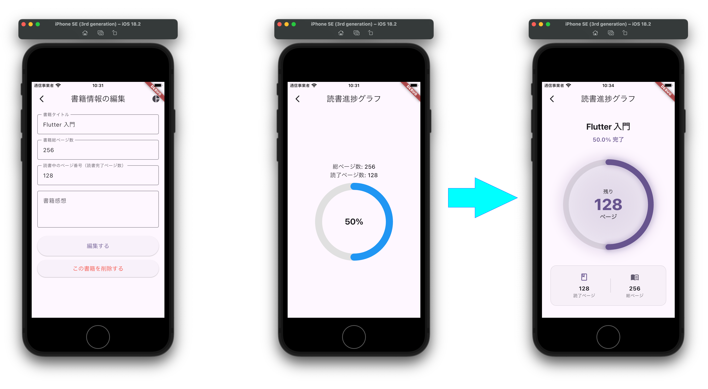

- 読了ページ更新の進捗達成リアクション表現（ベース表現） ⇒ アニメーション＋デコレーション表現  
  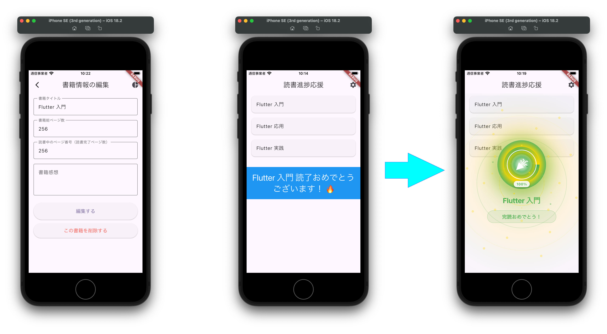

<br/>
<br/>

----------

## アプリ構想

アプリのコンセプトは、**読書支援** としたことを受け、

コンセプトのシチュエーションに従って `読書支援したい書籍の追加` や `読書中書籍の一覧表示` に、  
`読了ページの更新とそのタイミングでの進捗達成報告` や `読書進捗状況のグラフ表示`、さらにできれば  
アラーム設定など `何らかのタイミングでの激励や一喝` ができる **模擬アプリ** を作ることにしました。

これらを行うには、`管理したい書籍の追加など`を行う **設定画面（SettingsPage）** や、  
`読書中書籍の一覧表示`や`タップした書籍の選択`ができる **ホーム画面（HomePage）** と、  
`選択された書籍の情報を更新`する **書籍編集画面（ReadingBookPage）** に、  
`読了したページの進捗を可視化`する **グラフ表示画面（ReadingBookGraphPage）** を設け、  
`読書進捗率の達成ごとにメッセージをオーバラップ表示`させる、**アニメーション機能** を盛り込むことで、

単なるウィジェット・カタログにならないよう、ハンズオンに参加してくださるみなさんが実際に触ってみられること、  
リアルタイムでカスタム UIが表示され、読了ページの更新に伴ったリアクションや画面遷移ができることを目指します。

さらにこれら、書籍の新規追加や 読書中書籍の一覧表示、および選択された書籍の編集や削除のテストも追加したいものです。

...とはいえ実際に書籍情報を DBに永続化させたり、イベント管理のためにタイマーやバックグラウンドサービスを導入すると、  
コードやロジックが複雑になり、目的である `シンプルなベースUIコードとリッチなカスタムUIコードとの対比` の妨げになりますから、  
**導入するプラグインは、基本的な状態管理や画面遷移に留める** ことなどの制限をいれました。

- 【参照】アプリ要件初期稿 - [ハンズオン・アプリ要件](reference_documents/requirements.md)

<br/>
<br/>

----------

## 模擬アプリとしてのハンズオン・プロジェクト

この章と **'<a href="#%E3%83%99%E3%83%BC%E3%82%B9ui-%E3%81%A8%E3%82%AB%E3%82%B9%E3%82%BF%E3%83%A0ui-%E3%81%AE%E3%82%B3%E3%83%BC%E3%83%89%E3%82%84%E8%A6%8B%E6%A0%84%E3%81%88%E3%81%AE%E6%AF%94%E8%BC%83%E3%81%8C%E3%81%A7%E3%81%8D%E3%82%8B%E5%B7%A5%E5%A4%AB">ベースUI とカスタムUI のコードや見栄えの比較ができる工夫</a>'①** の章立て(注)は、  
**「模擬アプリが、『単なる動作するウィジェットカタログ』とならないようにする。」** ための説明章です。  

_どのようにして`模擬アプリを作っていったのか`や、模擬アプリに`どのような制限があるのか`や、  
どのようにして`ベースUIとカスタムUIを切り替え/差し替え可能にしているのか`の確認にご利用ください。_  

- _注：これらの章を飛ばしてハンズオン作業を行うために必要な、**'<a href="#%E3%83%8F%E3%83%B3%E3%82%BA%E3%82%AA%E3%83%B3%E9%96%8B%E7%99%BA%E7%92%B0%E5%A2%83%E3%82%92%E4%BD%9C%E3%82%8D%E3%81%86">ハンズオン開発環境を作ろう。</a>'②** にお進みください。_
- _注：続く、模擬アプリの基本機能や操作を説明する、**'<a href="#%E3%83%99%E3%83%BC%E3%82%B9ui-%E3%82%92%E8%A6%8B%E3%81%A6%E3%81%BF%E3%82%88%E3%81%86">ベースUI を見てみよう。</a>'③** は、軽く目を通す程度にご利用ください。_
- _①②③のリンクを開く際は、リンクURLが指定フラグメント・ベースになるため、右クリックして別ウィンドウでお開きください。_

### 全体方針
1. 実装詳細を理解してもらうためコード生成を使わない。  
2. 画面遷移に `go_router`、状態管理に `flutter_riverpod` を使うが、不変状態値には `freezed を使わない愚直実装` を行う。  
   またウィジェット内部状態の簡素化も `hooks_riverpod を使わない実装` で行い、プラグイン依存を基礎機能に限定させる。
3. 読書管理する書籍の新規追加や情報編集と削除の Unit test と Widget test を利用した簡易結合テストを実装する。  
4. 模擬アプリのため、読書中書籍情報の永続化やアラームは利用しない。このため擬似的に挙動を起こすようにする。  

### 基本設計

#### アーキテクチャ
**保守性**、 **拡張性**、 **理解容易性** を向上させる設計方針を満たすよう、  
アプリ全体で `レイヤードアーキテクチャ`を採用し、UIウィジェットには `MVVM アーキテクチャ`を適用します。  

- レイヤードアーキテクチャにより、  
  上位レイヤーは下位レイヤーにのみ依存させ、逆を認めない原則 ⇒  
  `上位レイヤーが、下位レイヤーのオブジェクトを保持する。`  
  `上位レイヤーは、下位レイヤーに公開インターフェース（状態取得 と 状態更新通知）のみを提供する。`により、  
  一方向の依存関係 ⇒ `上位下達の経路フロー`の実現と厳守を行い、設計方針を満足させます。

ビジネスロジックやデータアクセスの本体は、`状態データレイヤ`に、  
UIウィジェットでの状態データの取得や更新依頼は、`プレゼンテーションレイヤ`に実装することで **関心事の分離** を図ります。  

_これにより機能要件の追加や変更における、修正範囲の限定化（最小化）と影響範囲の明確化（依存関係制御）を確保して、  
保守性や拡張性およびコードの見通し（理解性）を向上させます。_

#### ハンズオン・プロジェクト全体構成
```text
lib
└── src
    ├── app                    
    │   ├── screen
    │   │   ├── home           読書中書籍一覧・ページウィジェット　　　（UIウィジェットのオブジェクトを保持）
    │   │   ├── reading        読書中書籍編集・ページウィジェット　　　（UIウィジェットのオブジェクトを保持）
    │   │   ├── reading_graph  読書中書籍進捗グラフ・ページウィジェット（UIウィジェットのオブジェクトを保持）
    │   │   └── settings       設定・ページウィジェット　　　　　　　　（UIウィジェットのオブジェクトを保持）
    │   └── app.dart           アプリ・ウィジェット（ページウィジェットのオブジェクトを保持）
    ├── application
    │   └── model
    │       └── application_model.dart  　　　    （ドメインモデルを保持するアプリケーションモデルを定義）
    ├── domain
    │   └── model
    │       ├── reading_books_domain_model.dart  （読書中書籍一覧のドメインモデルを定義）
    │       ├── reading_books_state_model.dart   （読書中書籍一覧のステートモデルを定義）
    │       ├── reading_books_value_object.dart  （読書中書籍一覧のValueObjectを定義）
    │       └── reading_book_value_object.dart   （読書中書籍のValueObjectを定義）
    ├── fundamental
    │   ├── model              基底基盤モデル　（状態モデルやValueObjectなどの基盤を定義）
    │   └── ui_widget          基底ウィジェット（ConsumerStagedWidgetなどを定義）
    ├── infrastructure
    ├── presentation
    │   ├── model    （各ViewModelオブジェクトは、状態種別と状態値を保持し、riverpod providerに保持されます）
    │   │   ├── default
    │   │   │   ├── reading_books_view_model.dart               （読書中書籍一覧の状態値を定義）
    │   │   │   ├── reading_progress_animation_view_model.dart  （読書中書籍進捗の状態種別と状態値を定義）
    │   │   │   ├── reading_support_animation_view_model.dart   （激励一喝の状態種別と状態値を定義）
    │   │   │   └── view_model_packages.dart                    （defaultディレクトリ用のバレルファイル）
    │   │   └── view_model_packages.dart                        （ViewModel全体統括のバレルファイル）
    │   ├── ui_widget（各UIウィジェットは、状態種別や状態値更新と連動するため providerオブジェクトをバインドします）
    │   │   ├── default
    │   │   │   ├── home
    │   │   │   │   ├── currently_tasks_widget.dart              読書中書籍一覧表示のUIウィジェット
    │   │   │   │   ├── reading_progress_animations_widget.dart  読書中書籍進捗表示のUIウィジェット
    │   │   │   │   └── reading_support_animations_widget.dart   激励一喝表示のUIウィジェット
    │   │   │   ├── reading
    │   │   │   │   └── reading_book_widget.dart                 読書中書籍編集表示のUIウィジェット
    │   │   │   ├── reading_graph
    │   │   │   │   └── reading_book_graph_widget.dart           読書中書籍進捗グラフ表示のUIウィジェット
    │   │   │   ├── settings
    │   │   │   │   └── reading_book_settings_widget.dart        設定表示のUIウィジェット
    │   │   │   └── widget_packages.dart                        （defaultディレクトリ用のバレルファイル）
    │   │   ├── challenge
    │   │   │   ├── home                                        （詳細構成については、completeを参照）
    │   │   │   ├── reading                                     （詳細構成については、completeを参照）
    │   │   │   ├── reading_graph                               （詳細構成については、completeを参照）
    │   │   │   ├── settings                                    （詳細構成については、completeを参照）
    │   │   │   └── widget_packages.dart                        （challengeディレクトリ用のバレルファイル）
    │   │   ├── complete
    │   │   │   ├── home
    │   │   │   │   ├── components
    │   │   │   │   │   └── progress                             読書中書籍進捗表示のUIコンポーネントを定義
    │   │   │   │   ├── currently_tasks_widget.dart              読書中書籍一覧表示のUIウィジェット
    │   │   │   │   ├── reading_progress_animations_widget.dart  読書中書籍進捗表示のUIウィジェット
    │   │   │   │   └── reading_support_animations_widget.dart   激励一喝表示のUIウィジェット
    │   │   │   ├── reading
    │   │   │   │   └── reading_book_widget.dart                 読書中書籍編集表示のUIウィジェット
    │   │   │   ├── reading_graph
    │   │   │   │   ├── components                               読書中書籍進捗グラフ表示のUIコンポーネントを定義
    │   │   │   │   └── reading_book_graph_widget.dart           読書中書籍進捗グラフ表示のUIウィジェット
    │   │   │   ├── settings
    │   │   │   │   └── reading_book_settings_widget.dart        設定表示のUIウィジェット
    │   │   │   └── widget_packages.dart                        （completeディレクトリ用のバレルファイル）
    │   │   └── widget_packages.dart                            （UIウィジェット全体統括のバレルファイル）
    │   └── routing                                              GoRouterの Named Routeを定義
    └── test                                                     Unit test と Widget test を定義
```

#### ハンズオン・プロジェクトのレイヤ構成

- **関心事のレイヤ構成**  
  - **状態データレイヤ** の依存関係  
    - **[アプリケーションモデル](../lib/src/application/model/application_model.dart)** が、状態データの取得や更新通知のインターフェースを提供するドメインモデルを保持し、  
    - **[ドメインモデル](../lib/src/domain/model/reading_books_domain_model.dart)** が、状態データの値の保持や更新および提供を行うステートモデルを保持して、  
    - **[ステートモデル](../lib/src/domain/model/reading_books_state_model.dart)** が、状態データが依存する DB等の機能を提供するインフラストラクチャを保持して、    
    - **値オブジェクト（[ValueObject](https://www.google.com/search?q=ValueObject+ddd)）
      [①](../lib/src/domain/model/reading_book_value_object.dart)[②](../lib/src/domain/model/reading_books_value_object.dart)** が、状態データのカレント値を表す不変データのクラス定義を担い、  
      - _ValueObject は、  
        ドメイン駆動設計（DDD）において、値そのものによって同一性を明示する、不変性のオブジェクトです。_  
    - **[インフラストラクチャ](../lib/src/infrastructure/package_info.dart)** が、プラグインによるDB等の基盤機能をラップするオブジェクトを保持します。  
      - _模擬アプリでは、データの永続化などを行いません。  
        このためプロジェクトのインフラストラクチャのレイヤは、利用されないので空実装（空ディレクトリ）になっています。  
        これにより読書中書籍一覧が永続化できないので、**ステートモデルの初期化処理では [ダミーデータ](https://github.com/FlutterKaigi/conference-handson-2025/blob/develop/lib/src/domain/model/reading_books_state_model.dart#L51-L69) を設定** しています。_

  - **プレゼンテーションレイヤ** の依存関係  
    _ここでは、UIウィジェットを [読書進捗率達成アニメーション表示](../lib/src/presentation/ui_widget/default/home/currently_tasks_widget.dart) に仮定しています。_  
    - **ページウィジェット** は、  
      [ホームページウィジェット](../lib/src/app/screen/home/home_page.dart) が UIウィジェットを保持するので、
      `状態データ更新とUIウィジェットの表示更新を同期させる`ため、  
      状態データとViewModelを提供する riverpodプロバイダーの監視と、UIウィジェットへのプロバイダーオブジェクトの  
      提供を行います。 
    - **UIウィジェット** は、  
      [読書進捗率達成アニメーション表示](../lib/src/presentation/ui_widget/default/home/currently_tasks_widget.dart) であれば、
      `表示種別に従ったアニメの表示|非表示と書籍名を表示させる`ため、  
      プロバイダーより提供された状態データ（表示種別）の他に、  
      [WidgetRef](https://pub.dev/documentation/flutter_riverpod/latest/flutter_riverpod/WidgetRef-class.html) を介して
      [読書中書籍一覧 ViewModel](../lib/src/presentation/model/default/reading_books_view_model.dart) から表示データ値（読書中書籍情報の書籍名）を取得して描画を行います。  
    - **プロバイダー** は、  
      riverpodの [NotifierProvider](https://pub.dev/documentation/flutter_riverpod/latest/flutter_riverpod/NotifierProvider-class.html) を表し、  
      [notifierプロパティ](https://pub.dev/documentation/flutter_riverpod/latest/flutter_riverpod/NotifierProvider/notifier.html) から
      対応する [ViewModel](../lib/src/presentation/model/default/reading_progress_animations_view_model.dart) を取得して、
      [stateプロパティ](https://pub.dev/documentation/flutter_riverpod/latest/flutter_riverpod/AnyNotifier/state.html) の値を状態データとして返します。
    - **ViewModel** は、  
      [読書進捗率達成 ViewModel](../lib/src/presentation/model/default/reading_progress_animations_view_model.dart) であれば、
      状態データとして 読了率 enum を返し、  
      [読書中書籍一覧 ViewModel](../lib/src/presentation/model/default/reading_books_view_model.dart) であれば、
      状態データとして [ドメインモデル](../lib/src/domain/model/reading_books_domain_model.dart) を介して  
      [ステートモデル](../lib/src/domain/model/reading_books_state_model.dart) から
      [読書中書籍一覧 ValueObject](../lib/src/domain/model/reading_books_value_object.dart) を取得して返します。
    - **ValueObject** は、  
      [読書中書籍一覧 ValueObject](../lib/src/domain/model/reading_books_value_object.dart) であれば、  
      読書中書籍情報の一覧として [読書中書籍 ValueObject](../lib/src/domain/model/reading_books_value_object.dart) の一覧を返します。

#### 自動テスト
**アプリケーションモデル** は、コンストラクタ引数オプションで、  
ステートモデル（状態データ）をラップする`ドメインモデルのオブジェクトを外部から依存注入できる`ようにしているだけでなく、  
そして **ドメインモデル** もコンストラクタ引数オプションで、`任意のステータスモデルのオブジェクトを外部から依存注入できる`うえ、  
さらに **ステートモデル** も、コンストラクタ引数オプションで、`任意のデータ値を外部から依存注入できる`ようにします。  

_これにより **[Unit test](../test/riverpod_reading_books_unit_test.dart)** や 
**[Widget test](../test/riverpod_reading_books_widget_test.dart)** で、  
**任意のデータ値の手動生成とアプリケーションモデルへの依存注入ができる** ようになっています。_

#### AI コード生成実験
ハンズオンプロジェクトでは、**[Gemini in Android Studio - Agent mode](https://developer.android.com/studio/gemini/agent-mode)** を取り入れ、  
実験的な AI コード生成を行っています。

- 【参照】プロンプト設計初期稿 - [Agent 指示プロンプト・メモ](reference_documents/prompt_memo.md)

### 使用プラグイン

ハンズオン・プロジェクトでは、`何がどうなっているのか`というコード実装詳細を見て理解してもらうため、  
便利なライブラリによる、処理実態の隠蔽化や、不慣れだと意図が判らない拡張機能をなるべく避けるようにしました。  
これにより使用するプラグインには、`コード生成を行わない`、`基礎機能に限定する` という制約をつけています。

このため 利用プラグインは、 **[go_router](https://pub.dev/packages/go_router)** と
**[flutter_riverpod](https://pub.dev/packages/flutter_riverpod)** に留めています。

- **go_router プラグイン利用の実装箇所**  
  ハンズオン・プロジェクトでは、画面遷移のために [名前付きルート｜Named routes topic](https://pub.dev/documentation/go_router/latest/topics/Named%20routes-topic.html) を使い、  
  [lib/src/routing/app_router.dart](../lib/src/routing/app_router.dart) でルーティング定義を行っています。

- **flutter_riverpod プラグイン利用の実装箇所**  
  riverpod 利用箇所については、ページウィジェットや UIウィジェットのプロバイダー実装箇所を参照ください。

- 【参照】[pubspec.yaml](../pubspec.yaml)

### ハンズオン・プロジェクト独自のライブラリ

#### 不変データクラス作成
riverpod を使う上で不変データの保証が必須です。
一般的に riverpod で不変データを扱うには、**[freezed](https://pub.dev/packages/freezed)** が使われますが、  
今回は愚直に、`hashCode`と`== オペレーター`のオーバーライドおよび、`JSON serialize | deserialize`の実装を行います。

- ハンズオンプロジェクトでは、`hashCode`と`== オペレーター`のオーバーライドを行う  
  プラグイン [equatable](https://pub.dev/packages/equatable) のユーティリティ [equatable_utils.dart](https://github.com/felangel/equatable/blob/fc5cf81060b3aab54fc6e641ebdfe998b00a619b/lib/src/equatable_utils.dart) のコードを利用させてもらい、  
  ハンズオン・プロジェクト用修正版 [lib/src/fundamental/model/equatable_utils.dart](../lib/src/fundamental/model/equatable_utils.dart) ユーティリティを作りました。

- どのようにこのユーティリティを使うのかは、`読書中書籍情報`と`読書中書籍情報一覧`の不変データクラス  
  **[ReadingBookValueObject](../lib/src/domain/model/reading_book_value_object.dart)** と
  **[ReadingBooksValueObject](../lib/src/domain/model/reading_books_value_object.dart)** の実装コードを確認下さい。  

  - 具体的には、  
    **[props](https://github.com/FlutterKaigi/conference-handson-2025/blob/develop/lib/src/domain/model/reading_book_value_object.dart#L108-L115)** に `値オブジェクトのプロパティ名一覧` を定義し、  
    **[hashCode](https://github.com/FlutterKaigi/conference-handson-2025/blob/develop/lib/src/domain/model/reading_book_value_object.dart#L97-L98)** と
    **[operator ==](https://github.com/FlutterKaigi/conference-handson-2025/blob/develop/lib/src/domain/model/reading_book_value_object.dart#L100-L106)** にボイラープレートコードを記述して、  
    **[copyWith](https://github.com/FlutterKaigi/conference-handson-2025/blob/develop/lib/src/domain/model/reading_book_value_object.dart#L81-L95)** を新規追加して、各プロパティの名前付引数と値指定時の更新ロジックを実装します。  
    _props は、値オブジェクト派生元の **[ValueObject](https://github.com/FlutterKaigi/conference-handson-2025/blob/develop/lib/src/fundamental/model/base_objects_model.dart#L191-L268) 抽象基盤クラス** により提供されます_

  - 併せてこれらの不変データクラスで `JSON serialize | deserialize`を担う、  
    **[toJson()](https://github.com/FlutterKaigi/conference-handson-2025/blob/develop/lib/src/domain/model/reading_book_value_object.dart#L64-L72)** と
    **[fromJson()](https://github.com/FlutterKaigi/conference-handson-2025/blob/develop/lib/src/domain/model/reading_book_value_object.dart#L29-L37)** のコードも確認ください。

#### StatefulWidget ラッパー作成
ウィジェットのサブツリー内で ListView 一覧表示を行う場合、ウィジェット内部状態に ScrollController が必要になるときもあります。  
一般的にウィジェットの内部状態を扱うときは、StatefulWidget＋Stateクラス作成の煩雑さを避けるため
**[hooks_riverpod](https://pub.dev/packages/hooks_riverpod)** が使われますが、  
今回は、プラグイン使用を基礎機能に限定するよう、StatefulWidget をラップして、派生先ウィジェットでStateクラスを作る必要のない、  
**[StagedWidget](../lib/src/fundamental/ui_widget/staged_widget.dart) 抽象基盤クラス** と
**[ConsumerStagedWidget](../lib/src/fundamental/ui_widget/consumer_staged_widget.dart) 抽象基盤クラス** を用意しました。  

- こららの抽象基盤クラスの使い方は、  
  **[App](../lib/src/app/app.dart)** や
  **[CurrentlyTasksWidget](../lib/src/presentation/ui_widget/default/home/currently_tasks_widget.dart)** の実装コードを確認下さい。

  - 具体的には、  
    ウィジェット内部状態型 **T** を 
    [_App<**T**>_](https://github.com/FlutterKaigi/conference-handson-2025/blob/develop/lib/src/app/app.dart#L9-L10) 
    または [_CurrentlyTasksWidget<R,**T**>_](https://github.com/FlutterKaigi/conference-handson-2025/blob/develop/lib/src/presentation/ui_widget/default/home/currently_tasks_widget.dart#L10-L11) のように、  
    派生先ウィジェットのジェネリクスで指定し、
    **[createWidgetState](https://github.com/FlutterKaigi/conference-handson-2025/blob/develop/lib/src/presentation/ui_widget/default/home/currently_tasks_widget.dart#L28-L30)** で `内部状態オブジェクト` を定義すれば、  
    **[initState](https://github.com/FlutterKaigi/conference-handson-2025/blob/develop/lib/src/presentation/ui_widget/default/home/currently_tasks_widget.dart#L32-L36)** や
    **[disposeState](https://github.com/FlutterKaigi/conference-handson-2025/blob/develop/lib/src/presentation/ui_widget/default/home/currently_tasks_widget.dart#L38-L42)** や
    **[build](https://github.com/FlutterKaigi/conference-handson-2025/blob/develop/lib/src/presentation/ui_widget/default/home/currently_tasks_widget.dart#L44-L78)** メソッドの state パラメータに内部状態オブジェクトが提供されるので、  
    各メソッドごとに必要な処理を実装します。  

<br/>
<br/>

----------

## ベースUI とカスタムUI のコードや見栄えの比較ができる工夫

ハンズオンのサブテーマは、**「ベースUIと カスタムUIの切り替えやコードと見栄えの比較ができる」** です。  
これは、**ベースUI**、**カスタムUI**、**ハンズオン作業中**...それぞれの UIコードについて、  
1. `作業ブランチを切り替えることなく、それぞれの UIコードが比較できる` だけでなく、  
2. `模擬アプリの UI表現が、手軽に切り替えられる` ことを要求しています。

_この要件を満たすため、以下の工夫を行っています。_

- ハンズオン・プロジェクトでは、`ベースUI`、`カスタムUI`、`ハンズオン作業中`の 各UIコードを、  
  **defaultディレクトリ**、**completeディレクトリ**、**challengeディレクトリ** に分けて配置することで、  
  一番目の `作業ブランチを切り替えることなく、それぞれのUIコードが確認できる` ようにしています。

- そして、二番目の`模擬アプリが参照する UI表現の切り替え`は、  
  **バレルファイル** に、`どのディレクトリ配下の UIコードを export する`のかを記述して、  
  `ページウィジェットは、バレルファイルから import した UIウィジェットを表示する`ことで実現します。

- さらに、`プレゼンテーションレイヤの依存関係の複雑さを隠蔽`するため、  
  StatefulWidget ラッパーの **ConsumerStagedWidget** にウィジェット内部状態管理だけでなく、  
  `状況ごとのビルドコードの切り替えや、riverpod プロバイダーとのボイラープレートコードの移譲機能`を追加しました。  

### バレルファイルについて

バレルファイル(Barrel files)は、複数のファイルを 1つの import文で済ませるための単一のファイルです。  
_今回の使い方では、default、complete、challenge 何れかの UIコードしかアプリで利用されなくなりますが、  
ハンズオンプロジェクトは、勉強用の模擬アプリのため、アプリで参照されないコードの発生を許容しています。  
また一般的には、 不必要な export を避けること、循環参照にならないようにする注意が必要なことに御留意ください。_

- 【参照】プロジェクトでの実装解説 - **[バレルファイル 解説ガイド](fundamental/barrel_file_guide.md)**  

### ConsumerStagedWidget について

たとえば、読了ページの更新ごとに、読了ページ数から(10%,50%,80%,100%の)進捗率達成状況をチェックして、  
閾値を超えていないので何も表示しないか、達成率別のメッセージを表示する、状況に応じたウィジェット再構築が行われるよう、    

**ConsumerStagedWidget** に、`riverpod プロバイダーの` **コンストラクタ・パラメータ注入** と、  
`プロバイダーからの状態値取得と、状態値による状況評価と、状況ごとに UI表示を変えるための` **selectBuild メソッド** と、  
`評価値ごとの UIウィジェット構築定義 ⇒ build関数を複数定義できるようにする` **build 〜 build19 メソッド** を追加しています。

- 【参照】プロジェクトでの実装解説 - **[ConsumerStagedWidget 解説ガイド](fundamental/ui_widget/consumer_staged_widget_guide.md)**

<br/>
<br/>

----------

## ハンズオン開発環境を作ろう。

ここまで、**FlutterKaigi 2025 ハンズオン** と **ハンズオン・リポジトリ（ハンズオン・プロジェクト）** の説明をいたしました。

ここからは、**ハンズオンに参加してくださったみなさまの作業** について説明させていただきます。  

### Flutter開発環境構築

Flutter開発環境および Android や iOS 開発のセットアップされていない場合は、  
公式サイト [Docs | Flutter](https://docs.flutter.dev/) で説明されている、以下の設定が完了している必要があります。

- Flutterセットアップ  
  _①②のインストール方法があります。_

  - ①基本的なインストール方法  
    [Install Flutter manually](https://docs.flutter.dev/install/manual)

  - ②VS Code利用のインストール方法  
    [Set up and test drive Flutter](https://docs.flutter.dev/get-started/quick)

  - _**Flutter SDK バージョンは、最新版にアップグレードしておいてください。**  
    (2025/11/01 現在) Flutter 3.35.7 channel stable, Dart 3.9.2, DevTools 2.48.0_
    - _過去のバージョンを使う必要がある場合は、後述の **`fvm`** をご利用ください。_

- モバイル開発セットアップ
  - Android 開発セットアップ  
    [Set up Android development](https://docs.flutter.dev/platform-integration/android/setup)

  - iOS 開発セットアップ  
    [Set up iOS development](https://docs.flutter.dev/platform-integration/ios/setup)

  - _このハンズオン・プロジェクトは、Flutter Web にも対応しています。  
    Android や iOS セットアップをされていない場合は、Chromeブラウザを使った動作確認もできます。_

Flutter開発環境(IDE)に `VS Code` や `Android Studio` を使う場合は、  
公式サイト [Tools | Flutter](https://docs.flutter.dev/tools) で説明されている、以下の設定が完了している必要があります。

- Flutter Developing Tools  
  [Tools | Flutter](https://docs.flutter.dev/tools)

  - Android Studio と IntelliJ  
    [Android Studio and IntelliJ | Flutter](https://docs.flutter.dev/tools/android-studio)

  - VS Code  
    [VS Code | Flutter](https://docs.flutter.dev/tools/vs-code)

### ハンズオン環境構築

ハンズオン・プロジェクトでは、チーム開発のため **[fvm](https://pub.dev/packages/fvm)** を使って Flutter バージョンを統一させており、  
また [Makefile](../Makefile) を利用して、模擬アプリの起動やユニットテストの実行も簡易化もしていますが、  
Flutter SDKが開発時最新版の 3.35.1 以上であれば、それらを利用する必要はありません。

**模擬アプリの起動** や **ユニットテストの実行** には、`flutter run` や `flutter test test/` コマンドや、  
`Android Studio` などの IDE が用意している、アプリ実行やテスト機能をご利用ください。

_**何らかの理由で、Flutter SDKを 3.35.1 未満にする必要がある場合**は、  
**[開発環境前提](https://github.com/FlutterKaigi/conference-handson-2025/blob/develop/README.md#%E9%96%8B%E7%99%BA%E7%92%B0%E5%A2%83%E5%89%8D%E6%8F%90)** を参照して、
`fvm` と `Makefile`の`make run`や`make unit-test`コマンドをご利用ください。_

- 【参照】プロジェクト開発環境構築 - [README.md](../README.md)

### リポジトリのクローン
Flutter開発環境構築とハンズオン環境構築が完了しましたら、  
ハンズオン・リポジトリ **[conference-handson-2025](https://github.com/FlutterKaigi/conference-handson-2025)** をクローンして、  
お使いの Android Studio や VS Code などの IDE で、リポジトリのプロジェクト・ルートを開いてください。

プロジェクトを開いたら、**外部パッケージを導入**するため、ターミナルで `flutter pub get`コマンドを実行するか、  
Android Studio なら `pubspec.yaml`を開き、画面上部にある `Pub get` ([画像](images/hands-on_setup_flutter_pub_get.png))をクリックしてください。  

- _何らかの理由で、`fvm` をお使いの場合は、`fvm flutter pub get`をご利用ください。_
- _Android Studio をお使いで、Markdownファイルのコードフェンス・エラー([画像](./images/hands-on_setup_show_problems_in_code_fences.png))が気になる場合は、  
  赤い電球アイコンを右クリックして `hide problems in code fences fix`([画像](./images/hands-on_setup_hide_problems_in_code_fences.png))をお試しください。_

<br/>
<br/>

----------

## ベースUI を見てみよう。

ハンズオン・プロジェクトの環境構築が済みましたので、まずは手始めにベース UI を確認してみましょう。  

### default バレルファイルを有効にする。

ベースUIのコードファイルは、`lib/src/presentation/ui_widget/default/`ディレクトリに配置されているので、  
**defaultディレクトリのバレルファイル(`lib/src/presentation/ui_widget/default/widget_packages.dart`)** が有効になるよう、  
**UIウィジェット・パッケージ全体のバレルファイル** を修正します。

UIウィジェット・パッケージ全体のバレルファイル [lib/src/presentation/ui_widget/widget_packages.dart](../lib/src/presentation/ui_widget/widget_packages.dart) を開いて、  
デフォルト設定(`default/widget_packages.dart`)の export 行のコメントアウトのみを外して、  
他の export 行がコメントアウトされていることを確認しましょう。  

```text
lib/src/presentation/ui_widget/widget_packages.dart

lib
├── src
│   ├── app
│   ├── application
│   ├── domain
│   ├── fundamental
│   ├── infrastructure
│   ├── presentation
│   │   ├── ui_widget
│   │   │   ├── default
│   │   │   ├── challenge
│   │   │   ├── complete
│   │   │   └── widget_packages.dart  // これが対象（UIウィジェット全体統括のバレルファイル）
```

```dart
// UI Widget として各ページごとの任意のパッケージをインポートできるようにするバレルパッケージです。

// デフォルト設定 （ui_widget/default）
export 'default/widget_packages.dart';

// 完成形設定 （ui_widget/complete）
// export 'complete/widget_packages.dart';

// ハンズオン設定 （ui_widget/challenge）
// export 'challenge/widget_packages.dart';
```
_ハンズオン・リポジトリを Gitクローンしてから、バレルファイルの変更をしていなければ、上記のようになっています。_

### ベースUI を使った機能要件表現を確認する

前ステップで、ui_widget/defaultディレクトリ配下の ベースUIのコードを参照させるようにしました。  
これで模擬アプリを起動すれば、ベースUIによる各種機能要件の表示が行われるようになっています。

- **Flutter SDK が最新版の場合(Flutter SDK 3.35.1 以上)**  
  ターミナルで `flutter run` を実行するか、  
  `Android Studio` のアプリ実行 ⇒ `Run 'main.dart'`を利用ください。

  - **fvm を利用する場合(Flutter SDK 3.35.1 未満)**

    - **macOS/Linux 環境の方へ**  
      ターミナルで `make run` を実行して、  
      起動中の iOSシミュレーターや Android エミュレータをデバイスとして選択してください。

    - **Windows 環境の方へ**  
      ターミナルで `fvm flutter run` を実行して、  
      起動中の iOSシミュレーターや Android エミュレータをデバイスとして選択してください。

  - _ハンズオン・プロジェクトの Flutter実行環境は、iOS/Android の他に Web も有効にしているので、  
    iOS シミュレータや Android エミュレーターでなく、Chromeで動作確認することもできます。_  

#### 読了したページの更新に伴う進捗率達成メッセージを表示する。
- ホーム画のFlutter入門をタップして、書籍編集画面を開きます。  
  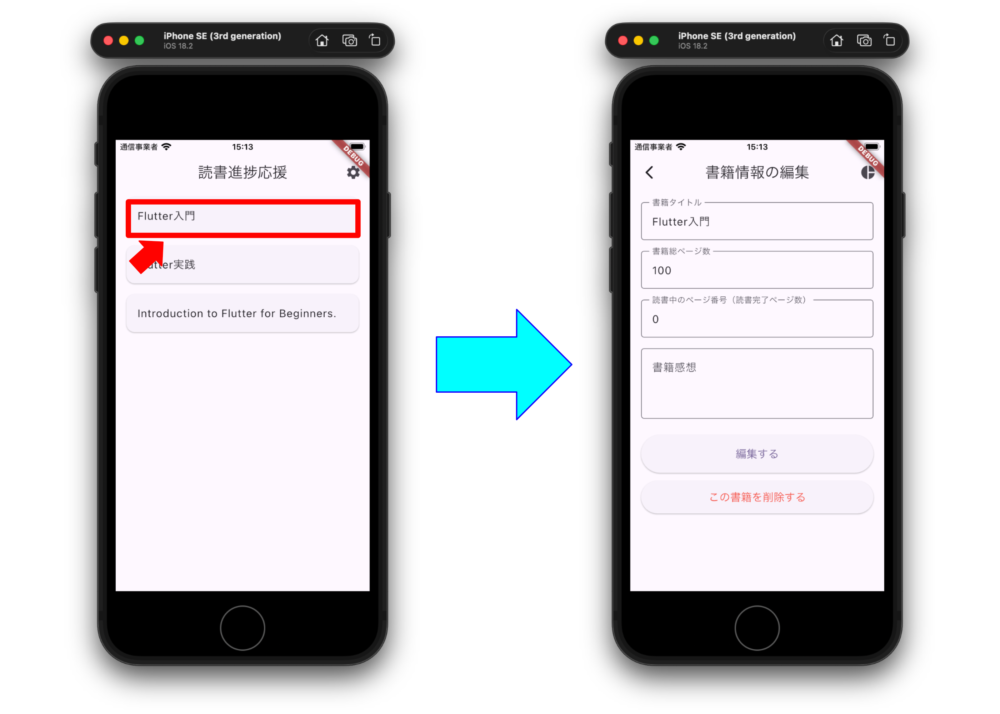

- 読書完了ページ数に 10 を入力して「編集する」のタップで、ホーム画面に戻れば、  
  総ページ数の 10%が達成されているので、進捗率 10%達成メッセージがオーバーラップ表示されます。  
  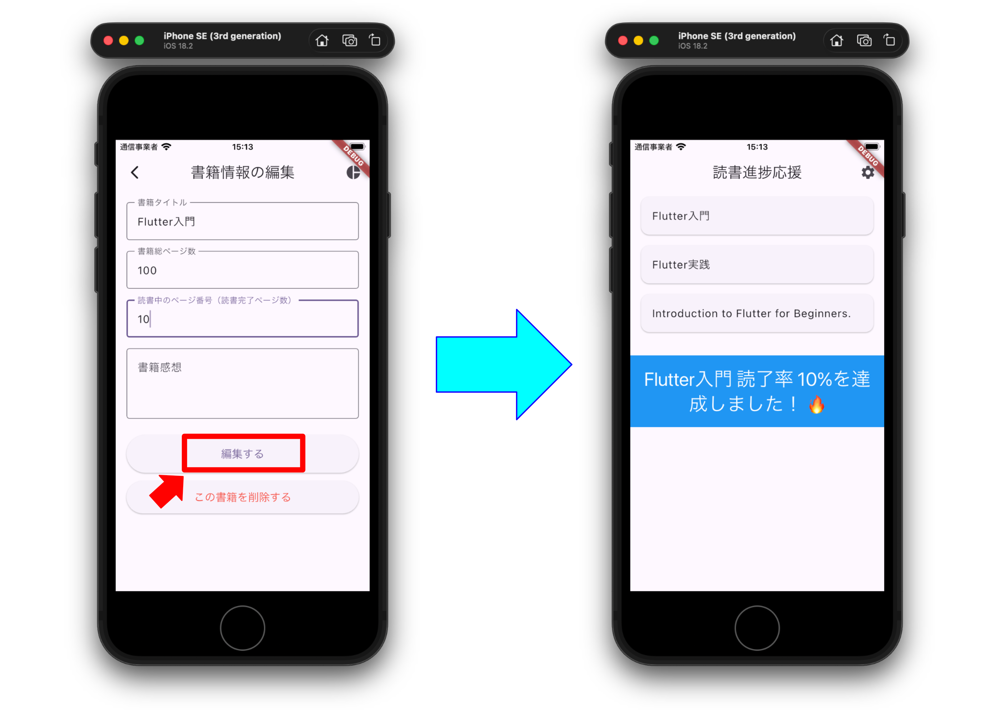

#### 読了したページの進捗をグラフで表示する。
- ホーム画のFlutter入門をタップして、書籍編集画面を開き、アプリバーにある円グラフアイコンをタップして、  
  グラフ画面を開けば、読了ページ数と総ページ数から、進捗率がドーナツグラフで表示されます。  
  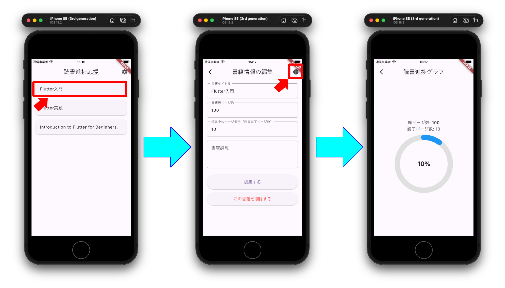

#### 激励や一喝のメッセージを表示する。
_この機能要件は、読書支援アプリが表示されたタイミングやアラーム設定など、  
何らかのイベントを契機に **激励や一喝のメッセージをオーバーラップ表示** させるものですが、  
模擬アプリでは、イベント発行のためにアラームプラグインなどを組み込まないことにしているため、  
設定画面の読書開始や読書終了スイッチの ON により、擬似イベントを発行していることに留意ください。_

- ホーム画のアプリバーにある歯車アイコンをタップして、設定画面を開き、  
  読書開始イベントのスイッチを ONにして、アプリバーのバックアイコンでホーム画面に戻らせます。
  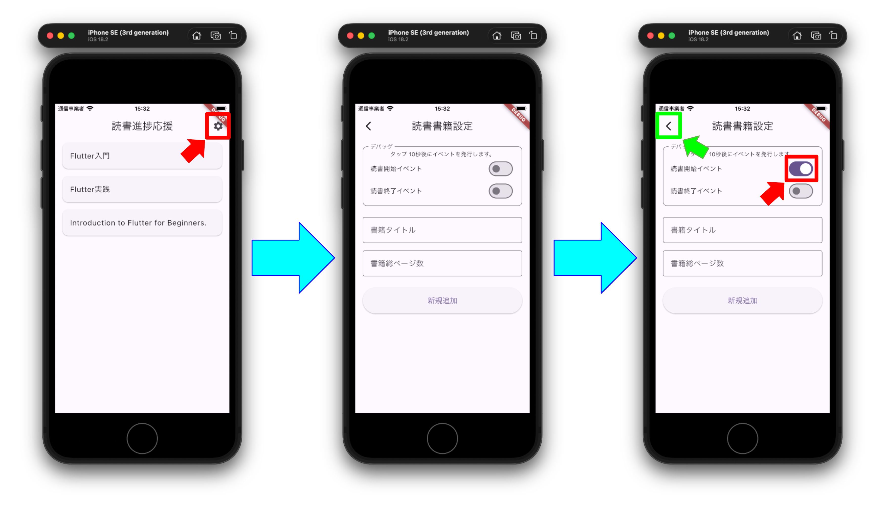

- イベント ON から10秒経過すると、激励メッセージがオーバーラップ表示されます。  
  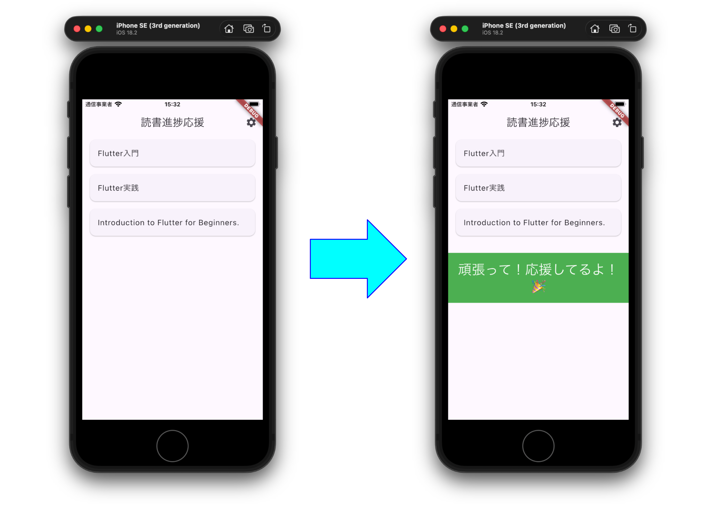

#### その他（基本要件確認）
カスタムUIを利用しない読書支援アプリの基本要件についても確認してみてください。

- **基本要件**  
  - **設定画面（SettingsPage）** での `書籍の新規追加`、  
  - **ホーム画面（HomePage）** での `一覧表示やタップした書籍の選択`、  
  - **書籍編集画面（ReadingBookPage）** での`書籍情報の編集や、書籍の削除`

##### 書籍の新規追加
- ホーム画のアプリバーにある歯車アイコンをタップして、設定画面を開きます。  
  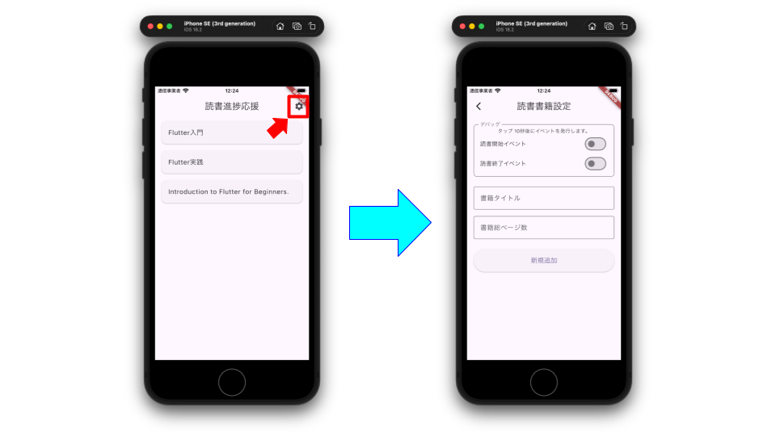

- 書籍名と総ページ数を入力して「新規追加」をタップすると、ホーム画面に書籍が追加されています。  
  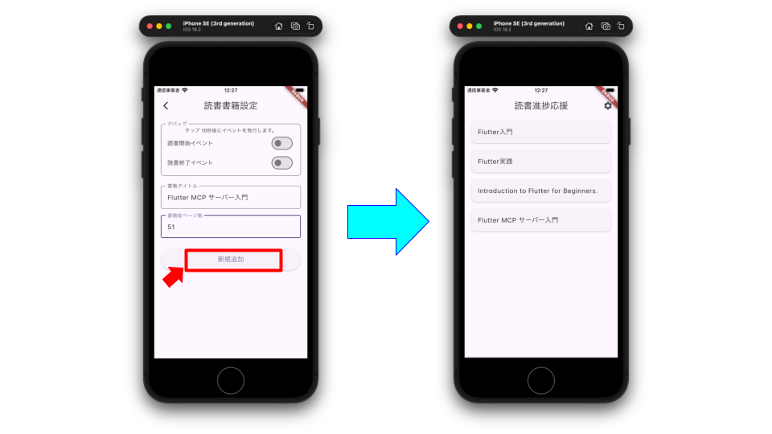

##### 一覧から選択した書籍の編集
- ホーム画の書籍一覧からMCPサーバー入門をタップして、書籍編集画面を開きます。  
  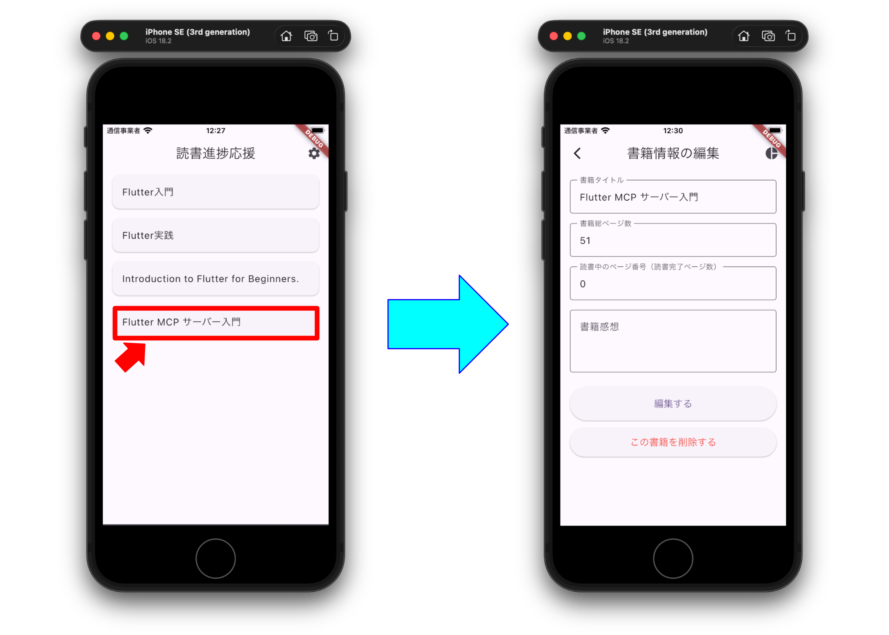

- 書籍名をMCPサーバー実践に変更して「編集する」をタップすると、ホーム画面の書籍名がMCPサーバー実践に更新されています。  
  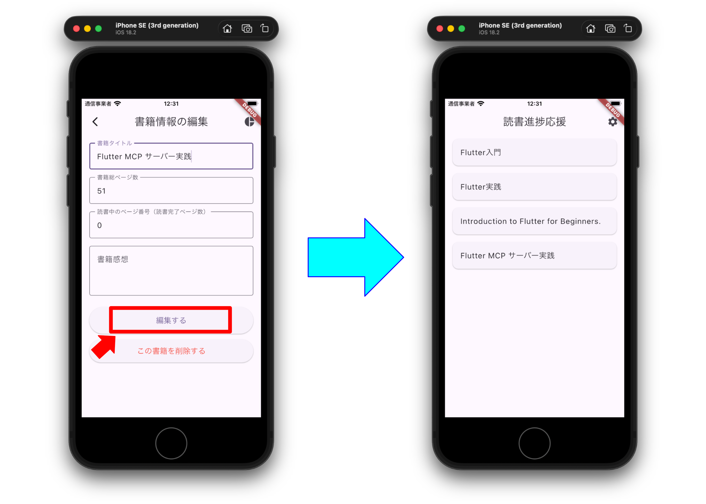

##### 一覧から選択した書籍の削除
- ホーム画の書籍一覧からMCPサーバー実践をタップして、書籍編集画面を開き、  
  「書籍を削除する」をタップして、確認ダイアログでも「削除」をタップします。  
  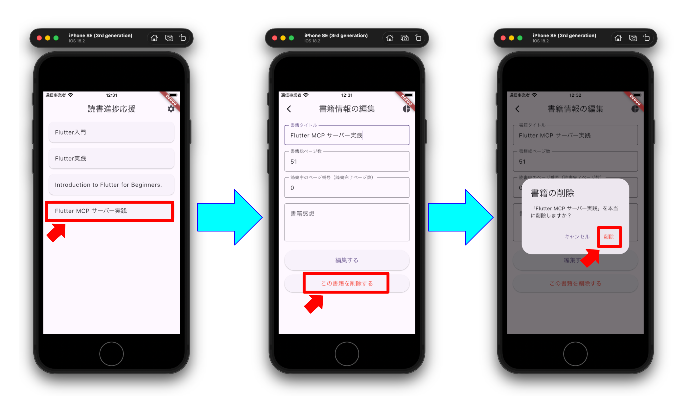

- ホーム画面の書籍一覧からMCPサーバー実践が削除されています。  
  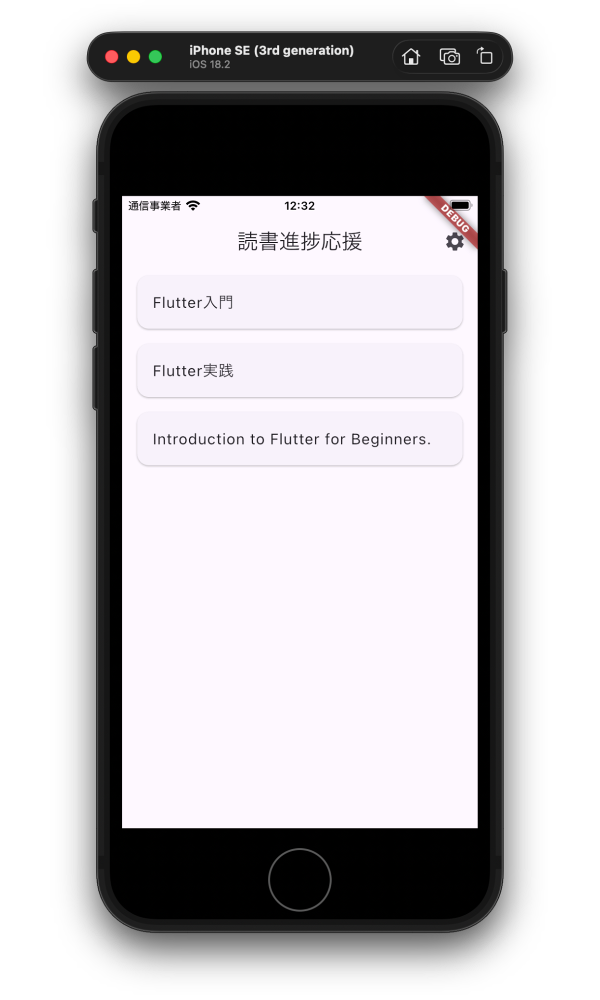

#### 自動テストについて
前段の **基本要件** については、Unit test も提供されていますので、あわせて御確認ください。

テストでは、各モデル機能をチェックする `riverpod`を介した **書籍の追加や編集と削除の単体テスト** と  
`Integration test`を模した、**画面操作のリアクションをチェックする Widget test** が設けられています。

- **Flutter SDK が最新版の場合(Flutter SDK 3.35.1 以上)**  
  ターミナルで `flutter test test/` を実行して、  
  ターミナルに出力される、テストステップと実行結果のログメッセージを確認してください。  
  あるいは、`Android Studio` などの単体テスト機能を利用ください。

  - **fvm を利用する場合(Flutter SDK 3.35.1 未満)**  

    - **macOS/Linux 環境の方へ**  
      ターミナルで `make unit-test` を実行して、  
      ターミナルに出力される、テストステップと実行結果のログメッセージを確認してください。

    - **Windows 環境の方へ**  
      ターミナルで `fvm flutter test test/` を実行して、  
      ターミナルに出力される、テストステップと実行結果のログメッセージを確認してください。

### ベースUI コードを確認する。

#### ベースUIコードに関連するファイル構成
```text
lib
└── src
    ├── app
    │   └── screen
    │       ├── home           読書中書籍一覧・ページウィジェット　　　（UIウィジェットのオブジェクトを保持）
    │       ├── reading        読書中書籍編集・ページウィジェット　　　（UIウィジェットのオブジェクトを保持）
    │       ├── reading_graph  読書中書籍進捗グラフ・ページウィジェット（UIウィジェットのオブジェクトを保持）
    │       └── settings       設定・ページウィジェット　　　　　　　　（UIウィジェットのオブジェクトを保持）
    ├── presentation
    │   ├── model    （各ViewModelオブジェクトは、状態種別と状態値を保持し、riverpod providerに保持されます）
    │   │   ├── default
    │   │   │   ├── reading_books_view_model.dart               （読書中書籍一覧の状態値を定義）
    │   │   │   ├── reading_progress_animation_view_model.dart  （読書中書籍進捗の状態種別と状態値を定義）
    │   │   │   ├── reading_support_animation_view_model.dart   （激励一喝の状態種別と状態値を定義）
    │   │   │   └── view_model_packages.dart                    （defaultディレクトリ用のバレルファイル）
    │   │   └── view_model_packages.dart                        （ViewModel全体統括のバレルファイル）
    │   ├── ui_widget（各UIウィジェットは、状態種別や状態値更新と連動するため providerオブジェクトをバインドします）
    │   │   ├── default
    │   │   │   ├── home
    │   │   │   │   ├── currently_tasks_widget.dart              読書中書籍一覧表示のUIウィジェット
    │   │   │   │   ├── reading_progress_animations_widget.dart  読書中書籍進捗表示のUIウィジェット
    │   │   │   │   └── reading_support_animations_widget.dart   激励一喝表示のUIウィジェット
    │   │   │   ├── reading
    │   │   │   │   └── reading_book_widget.dart                 読書中書籍編集表示のUIウィジェット
    │   │   │   ├── reading_graph
    │   │   │   │   └── reading_book_graph_widget.dart           読書中書籍進捗グラフ表示のUIウィジェット
    │   │   │   ├── settings
    │   │   │   │   └── reading_book_settings_widget.dart        設定表示のUIウィジェット
    │   │   │   └── widget_packages.dart                        （defaultディレクトリ用のバレルファイル）
    │   │   └── widget_packages.dart                            （UIウィジェット全体統括のバレルファイル）
```

#### ページウィジェット コード
- **screen**
  - **home（書籍一覧画面）**
    - [home_page.dart](../lib/src/app/screen/home/home_page.dart)  
      読書中書籍一覧画面のページウィジェット  
      -  _読書中書籍一覧表示のUIウィジェットに、`readingBooksProvider.notifier` を監視させてバインドします。_
      -  _読書中書籍進捗表示のUIウィジェットに、`readingSupportAnimationsProvider.notifier` を監視させてバインドします。_
      -  _激励一喝表示のUIウィジェットに、`readingProgressAnimationsProvider.notifier` を監視させてバインドします。_

  - **reading（書籍編集画面）**
    - [reading_book_page.dart](../lib/src/app/screen/reading/reading_book_page.dart)  
      読書中書籍編集画面のページウィジェット  
      -  _読書中書籍編集表示のUIウィジェットに、`readingBooksProvider.notifier` を監視させてバインドします。_

  - **reading_graph（書籍進捗率グラフ画面）**
    - [reading_graph_page.dart](../lib/src/app/screen/reading_graph/reading_graph_page.dart)  
      読書中書籍進捗率グラフのページウィジェット  
      -  _読書中書籍進捗グラフ表示のUIウィジェットに、`readingBooksProvider.notifier` を監視させてバインドします。_

  - **settings（設定画面）**
    - [settings_page.dart](../lib/src/app/screen/settings/settings_page.dart)  
      設定画面のページウィジェット  
      -  _設定表示のUIウィジェットに、`readingBooksProvider.notifier` を監視させてバインドします。_

#### ベースUI コード
- **ベースUIコード**  
  - **home（書籍一覧画面のUI表示）**  
    - [currently_tasks_widget.dart](../lib/src/presentation/ui_widget/default/home/currently_tasks_widget.dart)  
      読書中書籍一覧表示のUIウィジェット

    - [reading_progress_animations_widget.dart](../lib/src/presentation/ui_widget/default/home/reading_progress_animations_widget.dart)  
      読書中書籍進捗表示のUIウィジェット

    - [reading_support_animations_widget.dart](../lib/src/presentation/ui_widget/default/home/reading_support_animations_widget.dart)  
      激励一喝表示のUIウィジェット

  - **reading（書籍編集画面のUI表示）**  
    - [reading_book_widget.dart](../lib/src/presentation/ui_widget/default/reading/reading_book_widget.dart)  
      読書中書籍編集表示のUIウィジェット

  - **reading_graph（書籍進捗率グラフ画面のUI表示）**  
    - [reading_book_graph_widget.dart](../lib/src/presentation/ui_widget/default/reading_graph/reading_book_graph_widget.dart)  
      読書中書籍進捗グラフ表示のUIウィジェット

  - **settings（設定画面のUI表示）**  
    - [reading_book_settings_widget.dart](../lib/src/presentation/ui_widget/default/settings/reading_book_settings_widget.dart)  
      設定表示のUIウィジェット

- **UIウィジェット - バレルファイル**
  - **UIウィジェット全体統括用**  
    [widget_packages.dart](../lib/src/presentation/ui_widget/widget_packages.dart)  

    - **defaultディレクトリ用**  
      [widget_packages.dart](../lib/src/presentation/ui_widget/default/widget_packages.dart)  

#### ViewModel コード
_**ViewModel**は、`default`、`complete`、`challenge`ともに **defaultのコードを共用** しています。_

- **ViewModelコード**  
  - **default**  
    - [reading_books_view_model.dart](../lib/src/presentation/model/default/reading_books_view_model.dart)  
      読書中書籍一覧の状態値を保持する ViewModel  
      _オブジェクトは、`readingBooksProvider` に保持されます。_

    - [reading_progress_animations_view_model.dart](../lib/src/presentation/model/default/reading_progress_animations_view_model.dart)  
      読書中書籍進捗の状態種別と状態値を保持する ViewModel  
      _オブジェクトは、`readingProgressAnimationsProvider` に保持されます。_

    - [reading_support_animations_view_model.dart](../lib/src/presentation/model/default/reading_support_animations_view_model.dart)  
      激励一喝の状態種別と状態値を保持する ViewModel  
      _オブジェクトは、`readingSupportAnimationsProvider` に保持されます。_

- **ViewModel - バレルファイル**
  - **ViewModel全体統括用**  
    [view_model_packages.dart](../lib/src/presentation/model/view_model_packages.dart)

    - **defaultディレクトリ用**  
      [view_model_packages.dart](../lib/src/presentation/model/default/view_model_packages.dart)

<br/>
<br/>

----------

## カスタムUI を完成させよう。
ここからは実際に手を動かしつつカスタムUIの実装内容を確認していきます。

進行の都合上、全てのコードを紹介することはできませんが、重要な箇所を虫食い状態にしたコードを用意しております。

こちらの虫食いコードを使って実装を進めていきます。

### challenge バレルファイルを有効にする。
まずはバレルファイルを修正し、虫食いコードが配置されているファイル群をアプリケーション内で参照するようにします。

```text
lib/src/presentation/ui_widget/widget_packages.dart

lib
├── src
│   ├── app
│   ├── application
│   ├── domain
│   ├── fundamental
│   ├── infrastructure
│   ├── presentation
│   │   ├── ui_widget
│   │   │   ├── default
│   │   │   ├── challenge
│   │   │   ├── complete
│   │   │   └── widget_packages.dart  // これが対象（UIウィジェット全体統括のバレルファイル）
```

```dart
// UI Widget として各ページごとの任意のパッケージをインポートできるようにするバレルパッケージです。

// デフォルト設定 （ui_widget/default）
// export 'default/widget_packages.dart';

// 完成形設定 （ui_widget/complete）
// export 'complete/widget_packages.dart';

// ハンズオン設定 （ui_widget/challenge）
export 'challenge/widget_packages.dart';
```

現時点のコードは虫食い状態ですが、ビルド可能です。  
アプリケーションを起動しておくことで後続のハンズオンの動作確認がスムーズになります。  
今のうちに起動しておきましょう。

<br/>
<br/>

## 穴開きカスタムUI コードを完成させる。
ハンズオン作業はいくつかの工程に分けて進めていきます。  
各工程ごとに技術の説明と実装を行い、これを繰り返していきます。

実装するコードの完成系が虫食いの近くにコメントで添えてあります。  
ハンズオンは手入力でご参加いただいても、動作確認を目的にコメント解除で完成系コードを適用しても問題ありません。  
ご自身の取り組みやすい方法でご参加ください。

- **【補足】Flutter アニメーション説明資料紹介**  
  `穴開きカスタムUI コード`では、いくつかの Flutter アニメーション API が使われています。  
  このため Flutter アニメーション API 全般の基礎知識がないとコードで何をしているのか解らないと思います。  
  そこで Flutter アニメーションについて網羅的に説明された資料を紹介いたします。  
  _2020年5月の少々古い資料ですが、Flutter Animation API の基本は変わらないため参考にしていただければ幸いです。_
  - [Flutterアニメーション入門](https://drive.google.com/file/d/1Gr08nCcFdtVhRm2HMQvFSHDGlm9fz_dR/view)  
    - _null safety 以前のサンプルのため、そのままでは DartPad を利用したアニメーションが動きませんが、  
      `赤い下線で警告されている変数の型を Nullable variables に変更①`して、  
      `赤い下線で警告されているオブジェクトを ! オペレータで null 実行時チェック指定に変更②`すれば動作します。_  
      ① `AnimationController _controller;` ⇒ `AnimationController? _controller;`  
      ② `_controller.dispose();` ⇒ `_controller!.dispose();`

### 装飾を重ねて華やかな演出をする

- **この章でやること**  
  各書籍の読了ページ数を変更し「編集する」ボタンを押下するとホーム画面(書籍一覧ページ)に遷移します。  
  この時、読書進捗率に応じて表示する「進捗達成メッセージ」に、華やかなアニメーション追加しましょう。  
  　  
  まずは`中心から外側に向かって波紋のようにグラデーションが拡がる`、**メッセージ背景装飾のアニメーション** を追加します。

このパートでは次の Flutter API を扱います。

- **[AnimationController class](https://api.flutter.dev/flutter/animation/AnimationController-class.html)** と **[Animation class](https://api.flutter.dev/flutter/animation/Animation-class.html)**
  - _**[Animation class](https://api.flutter.dev/flutter/animation/Animation-class.html)** は、**[AnimationController class](https://api.flutter.dev/flutter/animation/AnimationController-class.html)** の super class であることに注意してください。_
- **[AnimatedBuilder ウィジェット](https://api.flutter.dev/flutter/widgets/AnimatedBuilder-class.html)** と、その進捗パラメータ animation の値 ⇒ **[Animation.value](https://api.flutter.dev/flutter/animation/Animation/value.html)**
- **[Stack ウィジェット](https://api.flutter.dev/flutter/widgets/Stack-class.html)** と **[unawaited() function](https://api.flutter.dev/flutter/dart-async/unawaited.html)**

`AnimationController`はアニメーションの進行を制御し、`Animation`はその変化の進行パターンを指定します。  
`AnimatedBuilder`は、`animation.value`の変化を検知してUIを自動的に再構築し、滑らかな動きを実現します。

各書籍の読了ページ数を変更し「編集する」ボタンを押下すると一覧ページに遷移します。  
この時、読書進捗率に応じて表示する「応援メッセージ」に、これらの技術を活用して、華やかなアニメーション追加します。

_hot restart を実行してから、現在の状況を確認しましょう。_

_**現時点では応援メッセージは表示されません**。_


<br/>

#### ステップ1: アニメーション設定の分割
- ステップ1からステップ3までの完成例  
  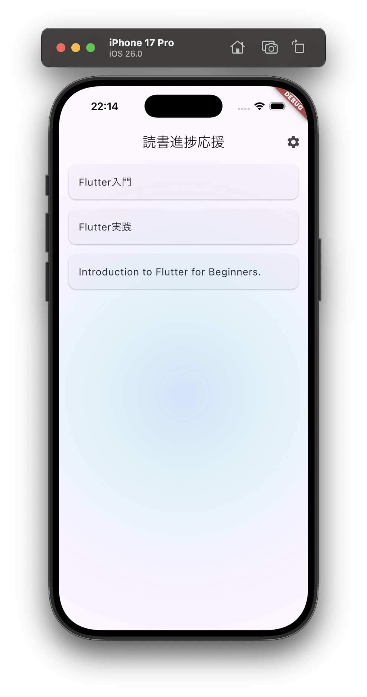

ステップ1では、アニメーションを実現するための「再生時間」と「動き」の設定を行います。  
このステップでは、次の二つのオブジェクトに設定を追加します。

- `AnimationController` に、アニメーションの再生時間（`duration`）の設定を追加します。  
  コンストラクタでは、以下の設定を行っています。

  - `duration`: アニメーションの再生時間を指定します。  
    _`Duration`クラスを使って時間長を指定します。_
  - `vsync`: アニメーションを画面のリフレッシュレートと同期させるための引数です。  
     _これにより、アニメーションがカクつかせず、滑らかに変化させます。_

- `Animation` は`AnimationController`の進行度の変化を、具体的な動きのパターンに変換します。  
  ここで使用する **[CurvedAnimation](https://api.flutter.dev/flutter/animation/CurvedAnimation-class.html)** はアニメーションの進行に緩急や正転|逆転をつけた動きを行わせるものです。  
  コンストラクタでは以下の設定を行っています。

  - `parent`: アニメーションの「時間軸」となる`AnimationController`を指定します。
  - `curve`: アニメーションの動きを指定します。`Curves.easeInOutSine`は、滑らかに加速して減速するパターンです。  
     これを繰り返すことにより、背景のグラデーションが穏やかに膨張・収縮、を繰り返す波のような効果を生み出します。
    - _**[Curves](https://api.flutter.dev/flutter/animation/Curves-class.html)クラス** は、「だんだん早く」や「徐々に遅く」など、  
      複数のアニメーションの緩急変化パターンを提供するコンテナです。_
      - _**[Curves.easeInOutSine](https://api.flutter.dev/flutter/animation/Curves/easeInOutSine-constant.html)** は、ゆっくりと始まり、加速し、ゆっくりと終わるアニメーション・パターンを表します。_

このステップではグラデーションのアニメーション表現を代表して実装します。  
このグラデーションは重ねる装飾のうちの一番下地になります。他の表現についても同様の構造でオブジェクトを用意しています。

それでは、グラデーション表現の`AnimationController`と`Animation`を用意しましょう。

**作業対象**
```
lib/src/presentation/ui_widget/challenge/home/reading_progress_animations_widget.dart

lib
├── src
│   ├── app
│   ├── application
│   ├── domain
│   ├── fundamental
│   ├── infrastructure
│   ├── presentation
│   │   ├── ui_widget
│   │   │   ├── challenge
│   │   │   │   ├── home
│   │   │   │   │   ├── components
│   │   │   │   │   ├── currently_tasks_widget.dart
│   │   │   │   │   ├── reading_progress_animations_widget.dart  // これが対象
│   │   │   │   │   └── reading_support_animations_widget.dart
```

修正前の時点ではグラデーション用のコードがコメントアウトされています。

- **修正前**  
**_ProgressAchievementAnimationState._initializeAnimations()** 
[L284-L288](https://github.com/FlutterKaigi/conference-handson-2025/blob/develop/lib/src/presentation/ui_widget/challenge/home/reading_progress_animations_widget.dart#L284-L288),
[L332-L336](https://github.com/FlutterKaigi/conference-handson-2025/blob/develop/lib/src/presentation/ui_widget/challenge/home/reading_progress_animations_widget.dart#L332-L336)
```dart
void _initializeAnimations() {
  // 省略（他のコントローラー）

  // ステップ1：アニメーションの設定の分割（再生時間）
  // _backgroundController = AnimationController(
  //   duration: const Duration(milliseconds: 5000),
  //   vsync: this,
  // );

  // 省略（他のアニメーション）

  // ステップ1：アニメーションの設定の分割（動き）
  // _backgroundAnimation = CurvedAnimation(
  //   parent: _backgroundController,
  //   curve: Curves.easeInOutSine,
  // );
}
```


`_backgroundController`変数は、グラデーションを5秒間かけて変化させるよう、時間の定義をしています。  
`duration`に、5000ミリ秒（5秒）を設定しています。

`_backgroundAnimation`変数は、グラデーションに滑らかに加速と減速を繰り返す波のような表現にするための動きの定義をしています。  
`CurvedAnimation`を使い、時間軸（`_backgroundController`）に`Curves.easeInOutSine`という緩急パターンを適用しています。

- **修正後**  
**_ProgressAchievementAnimationState._initializeAnimations()** 
[L284-L288](https://github.com/FlutterKaigi/conference-handson-2025/blob/develop/lib/src/presentation/ui_widget/challenge/home/reading_progress_animations_widget.dart#L284-L288),
[L332-L336](https://github.com/FlutterKaigi/conference-handson-2025/blob/develop/lib/src/presentation/ui_widget/challenge/home/reading_progress_animations_widget.dart#L332-L336)
```dart
void _initializeAnimations() {
  // 省略（他のコントローラー）

  // ステップ1：アニメーションの設定の分割（再生時間）
  _backgroundController = AnimationController(
    duration: const Duration(milliseconds: 5000),
    vsync: this,
  );

  // 省略（他のアニメーション）

  // ステップ1：アニメーションの設定の分割（動き）
  _backgroundAnimation = CurvedAnimation(
    parent: _backgroundController,
    curve: Curves.easeInOutSine,
  );
 }
```


<br/>

#### ステップ2: １層目の放射グラデーション
重ね合わせるアニメーション表現の一番下層の放射グラデーションを追加しましょう。  
このグラデーションは時間の進行に合わせて動くようにします。

- [AnimatedBuilder](https://api.flutter.dev/flutter/widgets/AnimatedBuilder-class.html) はアニメーションを動かすための再描画機能です。  
  引数で指定した`animation`の値が変化するたびに、`builder`メソッド内のUIを再構築します。  
  引数は次の通りです。

  - `animation`: アニメーションの変化を監視する`Animation`オブジェクトを指定します。  
    _前ステップで作成した`Animation`オブジェクトを指定します。_  
    _`Animation`オブジェクトは時間軸の変化に合わせて 0.0 から 1.0 まで範囲で変化する値を持ちます。_

  - `builder`: `Animation`オブジェクトの現在の値（`animation.value`）を使ってUIを構築するための関数を指定します。  
    _Animationの値が更新されるたびに呼び出され UIを再構築します。 ここで放射グラデーションの表現を組み立てます。_

- 放射グラデーションには、[RadialGradient](https://api.flutter.dev/flutter/painting/RadialGradient-class.html) を使います。  
  中心から外側に向かって色が放射状に変化するグラデーションを定義できます。  
  引数は次の通りです。

  - `center:` グラデーションの中心点を指定します。  
    _`Alignment.center`で中央に配置しています。_
  - `radius:` グラデーションが広がる半径を定義します。  
    _今回は`0.8 + animation.value * 0.4`の式を指定して、  
    `animation.value`（`0.0`から`1.0`に変化）に応じて、グラデーションの半径が`0.8`から`1.2`まで動的に変化するようにします。_
  - `colors:` グラデーションを構成する色のリストです。  
    _リストの最初の色がグラデーションの中心の色となり、リストの最後の色がグラデーションの最も外側の色になります。  
    グラデーションに使用する4つの色と、それぞれの透明度を定義します。  
    今回は`withValues`を使用して、  
    `Color` オブジェクトの値を`animation.value`の値の変化に応じて動的に変化するようにしています。  
    `primaryColor.withValues(alpha: 0.15 + animation.value * 0.1)` のように `alpha`（透明度）を動的に変更しています。_
  - `stops:` `colors` リストの色がグラデーションのどの位置（中心からの距離）で変化するかを制御します。  
    _要素の順番は`colors` の順番に対応しています。 0.0が中心に近く、1.0は最も外側になります。  
    それぞれの色が、グラデーションのどこで完全にその色になるかを指定します。_

それでは、グラデーションの動きを animation.value を使って動的な表現にしていきましょう。

**作業対象**
```
lib/src/presentation/ui_widget/challenge/home/components/progress/dynamic_background_widget.dart

lib
├── src
│   ├── app
│   ├── application
│   ├── domain
│   ├── fundamental
│   ├── infrastructure
│   ├── presentation
│   │   ├── ui_widget
│   │   │   ├── challenge
│   │   │   │   ├── home
│   │   │   │   │   ├── components
│   │   │   │   │   │   └── progress
│   │   │   │   │   │       ├── dynamic_background_widget.dart  // これが対象
│   │   │   │   │   │       ├── その他ウィジェット
│   │   │   │   │   ├── currently_tasks_widget.dart
│   │   │   │   │   ├── reading_progress_animations_widget.dart
│   │   │   │   │   └── reading_support_animations_widget.dart
```

この **[DynamicBackgroundWidget](https://github.com/FlutterKaigi/conference-handson-2025/blob/develop/lib/src/presentation/ui_widget/challenge/home/components/progress/dynamic_background_widget.dart#L4-L80)** では、  
[BoxDecoration](https://api.flutter.dev/flutter/painting/BoxDecoration-class.html) のコンストラクタ引数 `gradient`に
[RadialGradient](https://api.flutter.dev/flutter/painting/RadialGradient-class.html) を指定して放射状グラデーションを描画させ、  
`Stack`の子ウィジェットが配置される場所を制御する [Positioned ウィジェット](https://api.flutter.dev/flutter/widgets/Positioned-class.html) を使って放射状グラデーションを配置します。

修正前の時点では、animation.value とする部分が全て固定値１になっています。

- **修正前**  
**DynamicBackgroundWidget.build()** 
[L57-L59](https://github.com/FlutterKaigi/conference-handson-2025/blob/develop/lib/src/presentation/ui_widget/challenge/home/components/progress/dynamic_background_widget.dart#L57-L59),
[L61-L62](https://github.com/FlutterKaigi/conference-handson-2025/blob/develop/lib/src/presentation/ui_widget/challenge/home/components/progress/dynamic_background_widget.dart#L61-L62),
[L63-L68](https://github.com/FlutterKaigi/conference-handson-2025/blob/develop/lib/src/presentation/ui_widget/challenge/home/components/progress/dynamic_background_widget.dart#L63-L68)
```dart
@override
Widget build(BuildContext context) {
  // ステップ2: １層目の放射グラデーション
  return AnimatedBuilder(
    animation: animation,
    builder: (BuildContext context, Widget? child) {
      return Positioned.fill(
        child: Container(
          decoration: BoxDecoration(
            gradient: RadialGradient(
              center: Alignment.center,
              radius: 0.8 + 1 * 0.4,
              // radius: 0.8 + animation.value * 0.4,
              colors: <Color>[
                primaryColor.withValues(alpha: 0.15 + 1 * 0.1),
                // primaryColor.withValues(alpha: 0.15 + animation.value * 0.1),
                secondaryColor.withValues(
                  alpha: 0.08 + 1 * 0.05,
                ),
                // secondaryColor.withValues(
                //   alpha: 0.08 + animation.value * 0.05,
                // ),
                primaryColor.withValues(alpha: 0.03),
                Colors.transparent,
              ],
              stops: const <double>[0, 0.4, 0.7, 1],
            ),
          ),
        ),
      );
    },
  );
}
```


グラデーション半径と色の透明度を固定値ではなく、`Animation`オブジェクトから受け取れる動的な値に変更します。

- **修正後**  
**DynamicBackgroundWidget.build()** 
[L57-L59](https://github.com/FlutterKaigi/conference-handson-2025/blob/develop/lib/src/presentation/ui_widget/challenge/home/components/progress/dynamic_background_widget.dart#L57-L59),
[L61-L62](https://github.com/FlutterKaigi/conference-handson-2025/blob/develop/lib/src/presentation/ui_widget/challenge/home/components/progress/dynamic_background_widget.dart#L61-L62),
[L63-L68](https://github.com/FlutterKaigi/conference-handson-2025/blob/develop/lib/src/presentation/ui_widget/challenge/home/components/progress/dynamic_background_widget.dart#L63-L68)
```dart
@override
Widget build(BuildContext context) {
  // ステップ2: １層目の放射グラデーション
  return AnimatedBuilder(
    animation: animation,
    builder: (BuildContext context, Widget? child) {
      return Positioned.fill(
        child: Container(
          decoration: BoxDecoration(
            gradient: RadialGradient(
              center: Alignment.center,
              radius: 0.8 + animation.value * 0.4,
              colors: <Color>[
                primaryColor.withValues(alpha: 0.15 + animation.value * 0.1),
                secondaryColor.withValues(
                  alpha: 0.08 + animation.value * 0.05,
                ),
                primaryColor.withValues(alpha: 0.03),
                Colors.transparent,
              ],
              stops: const <double>[0, 0.4, 0.7, 1],
            ),
          ),
        ),
      );
    },
  );
}
```


<br/>

#### ステップ3: アニメーションの配置と実行
ここまでに作成した放射グラデーションを画面表示します。  
`Stack` の`children` に前のステップで操作した [DynamicBackgroundWidget](https://github.com/FlutterKaigi/conference-handson-2025/blob/develop/lib/src/presentation/ui_widget/challenge/home/components/progress/dynamic_background_widget.dart#L4-L80) を配置しましょう。

`DynamicBackgroundWidget`のコンストラクタ引数 animation には、  
バックグラウンド用アニメーションの進捗変化をもつ`Animation`オブジェクトと色を渡します。  
_なお、`DynamicBackgroundWidget.build()`では、進捗に応じて適用する色を変えるように作り込まれています。_

**作業対象**
```
lib/src/presentation/ui_widget/challenge/home/reading_progress_animations_widget.dart

lib
├── src
│   ├── app
│   ├── application
│   ├── domain
│   ├── fundamental
│   ├── infrastructure
│   ├── presentation
│   │   ├── ui_widget
│   │   │   ├── challenge
│   │   │   │   ├── home
│   │   │   │   │   ├── components
│   │   │   │   │   ├── currently_tasks_widget.dart
│   │   │   │   │   ├── reading_progress_animations_widget.dart  // これが対象
│   │   │   │   │   └── reading_support_animations_widget.dart
```

修正前の時点ではグラデーションの配置がコメントアウトされています。

- **修正前**  
**_ProgressAchievementAnimationState.build()** 
[L399-L404](https://github.com/FlutterKaigi/conference-handson-2025/blob/develop/lib/src/presentation/ui_widget/challenge/home/reading_progress_animations_widget.dart#L399-L404)
```dart
child: Stack(
  alignment: Alignment.center,
  children: <Widget>[
    // ステップ3: アニメーションの配置と実行
    // DynamicBackgroundWidget(
    //   animation: _backgroundAnimation,
    //   primaryColor: widget.primaryColor,
    //   secondaryColor: widget.secondaryColor,
    // ),
```


Stackウィジェットにグラデーションのウィジェットを配置します。  
バックグラウンド用アニメーションに必要な`Animation`オブジェクトや色情報を引数で渡しています。

- **修正後**  
**_ProgressAchievementAnimationState.build()** 
[L399-L404](https://github.com/FlutterKaigi/conference-handson-2025/blob/develop/lib/src/presentation/ui_widget/challenge/home/reading_progress_animations_widget.dart#L399-L404)
```dart
child: Stack(
  alignment: Alignment.center,
  children: <Widget>[
    // ステップ3: アニメーションの配置と実行
    DynamicBackgroundWidget(
      animation: _backgroundAnimation,
      primaryColor: widget.primaryColor,
      secondaryColor: widget.secondaryColor,
    ),
```


<br/>

続いて`unawaited()`を使ってアニメーションを開始させます。  
これによりアニメーションは、アプリの動作と平行に非同期で動作するようになります。  

_`unawaited()` は、非同期処理の完了を待たなくてよい場合に使用します。  
ここでは、`_backgroundController.repeat` が返す`Future` を待つ必要がないことを明示的に示します。_

アニメーションは、コントローラーが持つメソッドを実行することで開始されます。  
今回は`_backgroundController.repeat(reverse: true)`を実行し、繰り返し再生させます。

<br/>

修正前はグラデーションの開始がコメントアウトされています。

- **修正前**  
**_ProgressAchievementAnimationState._startAnimationSequence()** 
[L341-L342](https://github.com/FlutterKaigi/conference-handson-2025/blob/develop/lib/src/presentation/ui_widget/challenge/home/reading_progress_animations_widget.dart#L341-L342)
```dart
Future<void> _startAnimationSequence() async {
  // ステップ3: アニメーションの配置と実行
  // unawaited(_backgroundController.repeat(reverse: true));
```


`unawaited`により非同期で、`_backgroundController`が制御する背景グラデーションのアニメーションを開始させます。

- **修正後**  
**_ProgressAchievementAnimationState._startAnimationSequence()** 
[L341-L342](https://github.com/FlutterKaigi/conference-handson-2025/blob/develop/lib/src/presentation/ui_widget/challenge/home/reading_progress_animations_widget.dart#L341-L342)
```dart
Future<void> _startAnimationSequence() async {
  // ステップ3: アニメーションの配置と実行
  unawaited(_backgroundController.repeat(reverse: true));
```

- ステップ1からステップ3までの完成例（再掲）  
  

_hot restart を実行してから、ここまでの作業を再確認しましょう。_

なお、本サンプルアプリでは、応援メッセージは10秒後に自動的に非表示になるよう実装しています。


<br/>

#### ステップ4: ２層目の波紋
- ステップ4の完成例  
  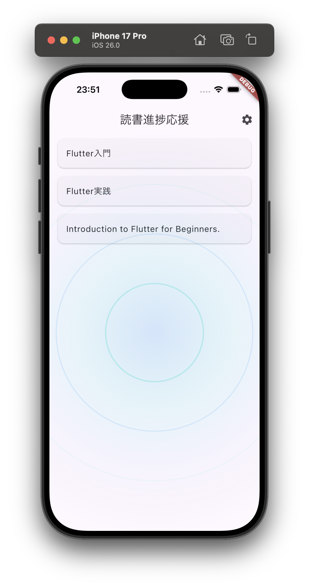

アニメーションを重ねて表示していることを体験するために、もう一つ重ねます。  
前ステップの放射グラデーションの上に波紋の表現を重ねましょう。

波紋を表す **[RippleEffectWidget](https://github.com/FlutterKaigi/conference-handson-2025/blob/develop/lib/src/presentation/ui_widget/challenge/home/components/progress/ripple_effect_widget.dart)** は作成済みです。  
ウィジェットの中では、**[CustomPainter](https://api.flutter.dev/flutter/rendering/CustomPainter-class.html)** から派生させた
**[_RippleEffectPainter](https://github.com/FlutterKaigi/conference-handson-2025/blob/develop/lib/src/presentation/ui_widget/challenge/home/components/progress/ripple_effect_widget.dart#L65-L129)** で、
**[CustomPainter.paint() method](https://api.flutter.dev/flutter/rendering/CustomPainter/paint.html)** をオーバライドして、  
**[Canvas](https://api.flutter.dev/flutter/dart-ui/Canvas-class.html)** に
**[Canvas .drawCircle() method](https://api.flutter.dev/flutter/dart-ui/Canvas/drawCircle.html)** を使い、円の描画を 0.25秒づつずらして 4回行なうことで波紋を表現します。

詳細はファイルの内容をご確認ください。  
_[lib/src/presentation/ui_widget/enhanced_progress/home/components/ripple_effect_widget.dart](https://github.com/FlutterKaigi/conference-handson-2025/blob/develop/lib/src/presentation/ui_widget/challenge/home/components/progress/ripple_effect_widget.dart)_

```
lib/src/presentation/ui_widget/challenge/home/reading_progress_animations_widget.dart

lib
├── src
│   ├── app
│   ├── application
│   ├── domain
│   ├── fundamental
│   ├── infrastructure
│   ├── presentation
│   │   ├── ui_widget
│   │   │   ├── challenge
│   │   │   │   ├── home
│   │   │   │   │   ├── components
│   │   │   │   │   ├── currently_tasks_widget.dart
│   │   │   │   │   ├── reading_progress_animations_widget.dart  // これが対象
│   │   │   │   │   └── reading_support_animations_widget.dart
```

修正前の時点ではグラデーションの上に重ねる波紋アニメーションの配置がコメントアウトされています。

- **修正前**  
**_ProgressAchievementAnimationState.build()** 
[L407-L412](https://github.com/FlutterKaigi/conference-handson-2025/blob/develop/lib/src/presentation/ui_widget/challenge/home/reading_progress_animations_widget.dart#L407-L412)
```dart
child: Stack(
  alignment: Alignment.center,
  children: <Widget>[
    // ステップ3: アニメーションの配置と実行
    DynamicBackgroundWidget(
      animation: _backgroundAnimation,
      primaryColor: widget.primaryColor,
      secondaryColor: widget.secondaryColor,
    ),

    // ステップ4: ２層目の波紋
    // RippleEffectWidget(
    //   animation: _rippleAnimation,
    //   primaryColor: widget.primaryColor,
    //   secondaryColor: widget.secondaryColor,
    // ),
```


コメントの解除で波紋アニメーションを配置します。  
`Stack`ウィジェットを使うことで、子ウィジェットをレイヤのように重ねて表示させています。

- **修正後**  
**_ProgressAchievementAnimationState.build()** 
[L407-L412](https://github.com/FlutterKaigi/conference-handson-2025/blob/develop/lib/src/presentation/ui_widget/challenge/home/reading_progress_animations_widget.dart#L407-L412)
```dart
child: Stack(
  alignment: Alignment.center,
  children: <Widget>[
    // ステップ3: アニメーションの配置と実行
    DynamicBackgroundWidget(
      animation: _backgroundAnimation,
      primaryColor: widget.primaryColor,
      secondaryColor: widget.secondaryColor,
    ),

    // ステップ4: ２層目の波紋
    RippleEffectWidget(
      animation: _rippleAnimation,
      primaryColor: widget.primaryColor,
      secondaryColor: widget.secondaryColor,
    ),

```

- ステップ4の完成例（再掲）  
  

_hot restart を実行してから、ここまでの作業を再確認しましょう。_


<br/>

#### まとめ
この工程では、アニメーションの「再生時間」と「動き」を  
`AnimationController`と`Animation`で個別に定義することで、複雑な演出を構造的に管理できることを確認しました。  

また`AnimatedBuilder`と`Animation`を使って、アニメーション値に応じて変化するUI表現ができること、  
さらに、`Stack`ウィジェットを利用して、複数の装飾を重ねて華やかなアニメーションを実装する手法を学びました。

この章で学んだ技術は、単一のアニメーションを実装するだけでなく、  
複数のアニメーションを協調させてリッチな表現を作り出すための基礎となります。

<br/>
<br/>

### 複数アニメーションを連動させる

- **この章でやること**  
  各書籍の読了ページ数を変更し「編集する」ボタンを押下するとホーム画面(書籍一覧ページ)に遷移します。  
  この時、読書進捗率に応じて表示する「進捗達成メッセージ」に、華やかなアニメーション追加しましょう。  
  　  
  次は、`メッセージが飛び出し、イメージが拡大縮小してお祝いする`、**メッセージと装飾のアニメーション** を追加します。

このパートでは次の Flutter API を扱います。

- **[Listenable.merge(Iterable<Listenable?> listenables) named constructor](https://api.flutter.dev/flutter/foundation/Listenable-class.html)** と、複数の **[Animation.value](https://api.flutter.dev/flutter/animation/Animation/value.html)**  
  - _**[Listenable class](https://api.flutter.dev/flutter/foundation/Listenable-class.html)** は、**[Animation class](https://api.flutter.dev/flutter/animation/Animation-class.html)** の super class です。_  
    _つまり、**[AnimatedBuilder ウィジェット](https://api.flutter.dev/flutter/widgets/AnimatedBuilder-class.html)** の進捗パラメータ animation の値 ⇒ **[Animation.value](https://api.flutter.dev/flutter/animation/Animation/value.html)** は、複数束ねられます。_  
    _また、**[Animation class](https://api.flutter.dev/flutter/animation/Animation-class.html)** は、**[AnimationController class](https://api.flutter.dev/flutter/animation/AnimationController-class.html)** の super class であることにも注意してください。_

ここでは、複数のアニメーションを協調させて複雑な演出を作り出します。  

`Listenable.merge`を使うことで、複数の独立した`AnimationController`を一つにまとめて監視できます。  
そして、１つのUI表現のなかで複数の異なる時間軸のアニメーション値（animation.value）を順番に適用させることで、  
応援メッセージの中心となるコンテンツに複数の変化を与えるようにします。

#### ステップ1: 複数のコントローラーを統合的に監視
- ステップ1の完成例  
  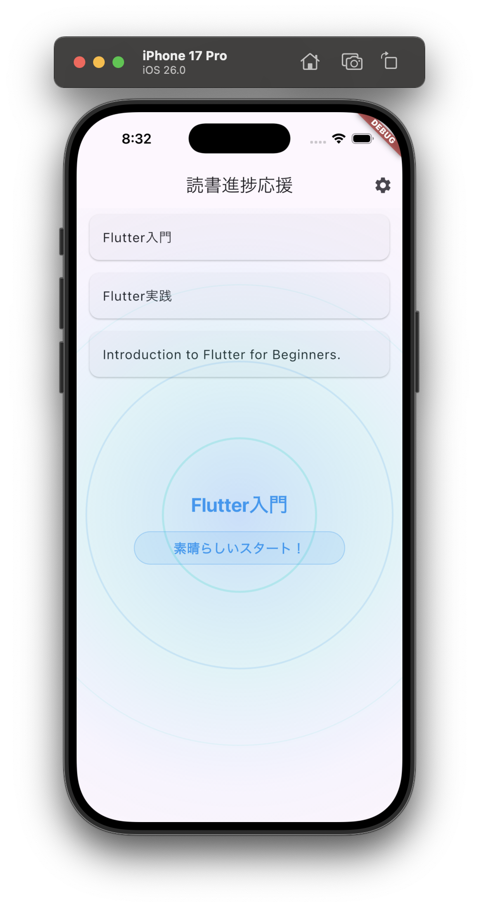


複数のアニメーションを組み合わせた統合的な制御を行うよう設定しましょう。

これまでの放射グラデーションなどでは、`AnimatedBuilder` の引数には単一の`Animation` オブジェクトを渡していました。  
これは時間経過によるUI更新を渡した`Animation`に紐づいた単一の`AnimationController`を監視することにより実現していました。

今回は、複数の時間軸によるアニメーション値の変化を利用します。  
`AnimatedBuilder`の`animation`引数に`Listenable.merge`を指定することで、  
コンストラクタパラメータの複数の`AnimationController`を一つのリスナーとして統合します。

ここでは、`_mainController`, `_progressController`, `_pulseController`を監視させ、  
[_startAnimationSequence()](https://github.com/FlutterKaigi/conference-handson-2025/blob/develop/lib/src/presentation/ui_widget/challenge/home/reading_progress_animations_widget.dart#L339-L369) で、
それぞれのアニメーションの再生順番や再生方法を指定することにより、  
メッセージが飛び出してきたような表現や、そのあとでイメージが拡大縮小を繰り返すような表現を行なうように制御します。

`AnimatedBuilder`は、再生中のアニメーション値が変化するごとに 子ウィジェットの再構築を行うだけですが、  
これにより複数のアニメーションを連動させたUI構築が可能になります。

**作業対象**
```
lib/src/presentation/ui_widget/challenge/home/reading_progress_animations_widget.dart

lib
├── src
│   ├── app
│   ├── application
│   ├── domain
│   ├── fundamental
│   ├── infrastructure
│   ├── presentation
│   │   ├── ui_widget
│   │   │   ├── challenge
│   │   │   │   ├── home
│   │   │   │   │   ├── components
│   │   │   │   │   ├── currently_tasks_widget.dart
│   │   │   │   │   ├── reading_progress_animations_widget.dart  // これが対象
│   │   │   │   │   └── reading_support_animations_widget.dart
```

修正前の時点では、`Stack`でグラデーションと波紋のウィジェットを重ねて配置しています。  
その上に応援メッセージの中心となるコンテンツを配置しましょう。

- **修正前**  
**_ProgressAchievementAnimationState.build()** 
[L415-L431](https://github.com/FlutterKaigi/conference-handson-2025/blob/develop/lib/src/presentation/ui_widget/challenge/home/reading_progress_animations_widget.dart#L415-L431)
```dart
child: Stack(
  alignment: Alignment.center,
  children: <Widget>[
    DynamicBackgroundWidget(省略

    RippleEffectWidget(省略

    // ステップ1: 複数のコントローラーを統合的に監視
    // AnimatedBuilder(
    //   animation: Listenable.merge(<Listenable>[
    //     _mainController,
    //     _progressController,
    //     _pulseController,
    //   ]),
    //   builder: (BuildContext context, Widget? child) {
    //     return FadeTransition(
    //       opacity: _fadeAnimation,
    //       child: Transform.scale(
    //         scale: _scaleAnimation.value * _bounceAnimation.value,
    //         child: _buildMainContent(),
    //       ),
    //     );
    //   },
    // ),
```


`Listenable.merge`で複数のコントローラーを監視します。  
これにより複数のアニメーション値の変化を組み合わせた表現が可能になります。

このステップでは`Listenable.merge`が主題です。  
ハンズオン負荷軽減のため`builder`以下はコメント解除にて実装してください。

_ちなみに [FadeTransition ウィジェット](https://api.flutter.dev/flutter/widgets/FadeTransition-class.html) は、子ウィジェットの不透明度を変化(遷移)させるアニメーション表現を行います。_  
_また [Transform ウィジェット](https://api.flutter.dev/flutter/widgets/Transform-class.html) は、子ウィジェットを変形させるアニメーション表現を担い、  
[Transform.scale() named constructor](https://api.flutter.dev/flutter/widgets/Transform/Transform.scale.html) で拡大縮小を行います。_

- **修正後**  
**_ProgressAchievementAnimationState.build()** 
[L415-L431](https://github.com/FlutterKaigi/conference-handson-2025/blob/develop/lib/src/presentation/ui_widget/challenge/home/reading_progress_animations_widget.dart#L415-L431)
```dart
child: Stack(
  alignment: Alignment.center,
  children: <Widget>[
    DynamicBackgroundWidget(省略

    RippleEffectWidget(省略

    // ステップ1: 複数のコントローラーを統合的に監視
    AnimatedBuilder(
      animation: Listenable.merge(<Listenable>[
        _mainController,
        _progressController,
        _pulseController,
      ]),
      builder: (BuildContext context, Widget? child) {
        return FadeTransition(
          opacity: _fadeAnimation,
          child: Transform.scale(
            scale: _scaleAnimation.value * _bounceAnimation.value,
            child: _buildMainContent(),
          ),
        );
      },
    ),
```

- ステップ1の完成例（再掲）  
  

_hot restart を実行してから、ここまでの作業を再確認しましょう。_

`書籍名`、`応援メッセージ`が表示されました。  
_ここで表示されていない`進捗率とアイコンを納めた円形イメージ`は、後続のステップで表示させます。_

`builder`での記述に登場する`_fadeAnimation`、`_scaleAnimation`、`_bounceAnimation`は、  
いずれも`_mainController`で管理されており、同じ時間軸のなかで動いています。

ですので `Listenable.merge`の特徴はまだ発揮されていません。  
統合した他のコントローラーの値を利用しているのは [_buildMainContent()](https://github.com/FlutterKaigi/conference-handson-2025/blob/develop/lib/src/presentation/ui_widget/challenge/home/reading_progress_animations_widget.dart#L455-L494) の中です。

これは、後続のステップで修正します。


<br/>

#### ステップ2: プログレス円とアイコンを配置
- ステップ2の完成例  
  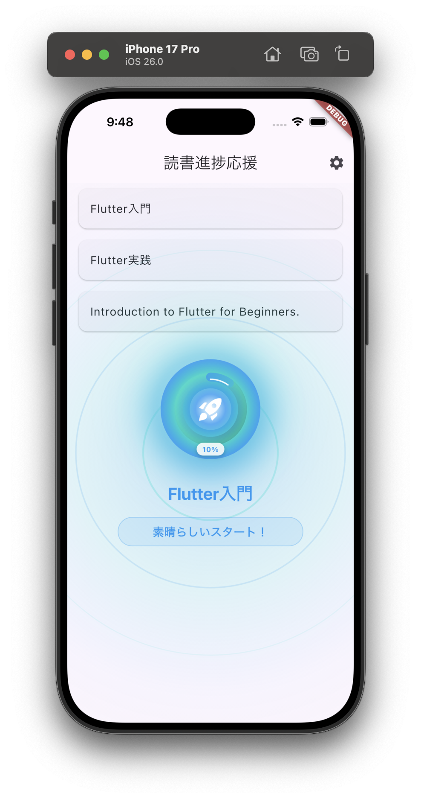

このステップでは、進捗率とアイコンを納めた円形イメージの表示を担うウィジェットを配置します。  
技術的に新しいものはないので、コメントを解除して実装しましょう。

ここで扱う **[_buildMainContent()](https://github.com/FlutterKaigi/conference-handson-2025/blob/develop/lib/src/presentation/ui_widget/challenge/home/reading_progress_animations_widget.dart#L455-L494)** は、`書籍名`、`応援メッセージ`、`進捗率とアイコンを納めた円形イメージ`の配置を担います。  
_進捗率とアイコンを納めた円形イメージの表示は、追加配置する`ProgressCircleWidget`ウィジェットが担います。_

追加配置する **[ProgressCircleWidget](https://github.com/FlutterKaigi/conference-handson-2025/blob/develop/lib/src/presentation/ui_widget/challenge/home/components/progress/progress_circle_widget.dart#L6-L189)** には、
引数で２つの`Animation`オブジェクト `_progressAnimation`と`_pulseAnimation`を渡します。  
_これらは、前ステップの`Listenable.merge`で監視している`_progressController`と`_pulseController`を利用しています。_

**作業対象**
```
lib/src/presentation/ui_widget/challenge/home/reading_progress_animations_widget.dart

lib
├── src
│   ├── app
│   ├── application
│   ├── domain
│   ├── fundamental
│   ├── infrastructure
│   ├── presentation
│   │   ├── ui_widget
│   │   │   ├── challenge
│   │   │   │   ├── home
│   │   │   │   │   ├── components
│   │   │   │   │   ├── currently_tasks_widget.dart
│   │   │   │   │   ├── reading_progress_animations_widget.dart  // これが対象
│   │   │   │   │   └── reading_support_animations_widget.dart
```

修正前は、進捗率とアイコンを納めた円形イメージを表示する`ProgressCircleWidget`の配置がコメントアウトされています。

- **修正前**  
**_ProgressAchievementAnimationState._buildMainContent()** 
[L468-L476](https://github.com/FlutterKaigi/conference-handson-2025/blob/develop/lib/src/presentation/ui_widget/challenge/home/reading_progress_animations_widget.dart#L468-L476)
```dart
Widget _buildMainContent() {
  return SizedBox(
    width: 400,
    child: Column(
      mainAxisSize: MainAxisSize.min,
      mainAxisAlignment: MainAxisAlignment.center,
      children: <Widget>[
        // ステップ2: プログレス円とアイコンを配置
        // ProgressCircleWidget(
        //   progressAnimation: _progressAnimation,
        //   pulseAnimation: _pulseAnimation,
        //   progressPercent: widget.progressPercent,
        //   primaryColor: widget.primaryColor,
        //   secondaryColor: widget.secondaryColor,
        //   icon: widget.icon,
        // ),
```


`ProgressCircleWidget`に複数の`Animation`を渡して配置しましょう。  
_これらの`Animation`の値の利用を設定するのは、次のステップになります。_

- **修正後**  
**_ProgressAchievementAnimationState._buildMainContent()** 
[L468-L476](https://github.com/FlutterKaigi/conference-handson-2025/blob/develop/lib/src/presentation/ui_widget/challenge/home/reading_progress_animations_widget.dart#L468-L476)
```dart
Widget _buildMainContent() {
  return SizedBox(
    width: 400,
    child: Column(
      mainAxisSize: MainAxisSize.min,
      mainAxisAlignment: MainAxisAlignment.center,
      children: <Widget>[
        // ステップ2: プログレス円とアイコンを配置
        ProgressCircleWidget(
          progressAnimation: _progressAnimation,
          pulseAnimation: _pulseAnimation,
          progressPercent: widget.progressPercent,
          primaryColor: widget.primaryColor,
          secondaryColor: widget.secondaryColor,
          icon: widget.icon,
        ),
```

- ステップ2の完成例（再掲）  
  

_hot restart を実行してから、ここまでの作業を再確認しましょう。_

`書籍名`、`応援メッセージ`、`進捗率とアイコンを納めた円形イメージ`が表示されました。  
現時点ではサイズは固定、応援メッセージも円形イメージも動かない状態ですが、次のステップで修正します。


<br/>

#### ステップ3: アニメーションの値で動きを実現
- ステップ3の完成例  
  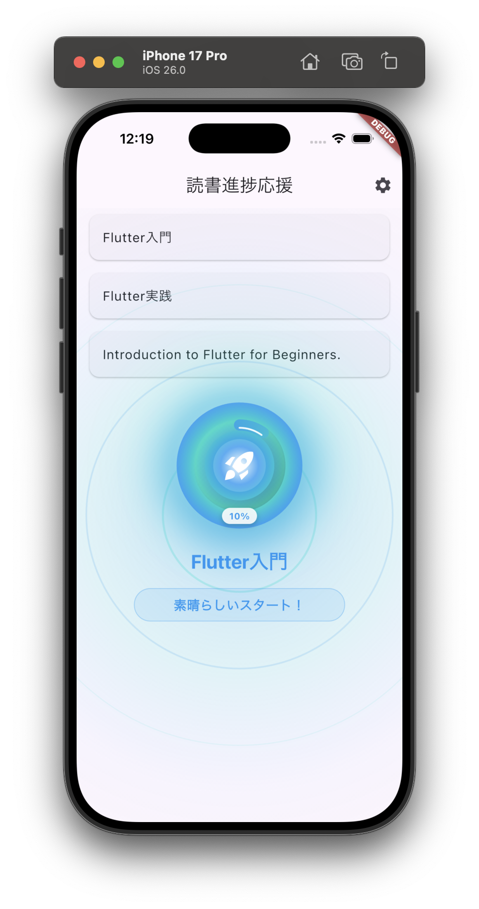

**作業対象**
```
lib/src/presentation/ui_widget/challenge/home/components/progress/progress_circle_widget.dart

lib
├── src
│   ├── app
│   ├── application
│   ├── domain
│   ├── fundamental
│   ├── infrastructure
│   ├── presentation
│   │   ├── ui_widget
│   │   │   ├── challenge
│   │   │   │   ├── home
│   │   │   │   │   ├── components
│   │   │   │   │   │   └── progress
│   │   │   │   │   │       ├── progress_circle_widget.dart  // これが対象
│   │   │   │   │   │       ├── その他ウィジェット
│   │   │   │   │   ├── currently_tasks_widget.dart
│   │   │   │   │   ├── reading_progress_animations_widget.dart
│   │   │   │   │   └── reading_support_animations_widget.dart
```

進捗率とアイコンを納めた円形イメージを表す **[ProgressCircleWidget](https://github.com/FlutterKaigi/conference-handson-2025/blob/develop/lib/src/presentation/ui_widget/challenge/home/components/progress/progress_circle_widget.dart#L6-L189)** 内で、アニメーション値を利用して動きをつけます。

コード内の５箇所でアニメーション値を利用しています。

1. `Transform.scale` を使い円全体を拡大・縮小します。  
   `scale`プロパティに`double`値を指定することで、子ウィジェットのサイズを変更します。  
   ここに`pulseAnimation.value`を適用し、アニメーションの進行に合わせて拡大率を変更させます。  
   _`pulseAnimation.value`の値は、0.95〜1.15 を往復するように設定しています。_  
    
    - **修正前**  
    **ProgressCircleWidget.build()** 
    [L68-L70](https://github.com/FlutterKaigi/conference-handson-2025/blob/develop/lib/src/presentation/ui_widget/challenge/home/components/progress/progress_circle_widget.dart#L68-L70)
    ```dart
     return Transform.scale(
       // ステップ3: アニメーションの値で動きを実現①
       scale: 1,
       // scale: pulseAnimation.value,
       child: Container(
    ```

    

   - **修正後**  
      **ProgressCircleWidget.build()** 
      [L68-L70](https://github.com/FlutterKaigi/conference-handson-2025/blob/develop/lib/src/presentation/ui_widget/challenge/home/components/progress/progress_circle_widget.dart#L68-L70)
    ```dart
    return Transform.scale(
      // ステップ3: アニメーションの値で動きを実現①
      scale: pulseAnimation.value,
      child: Container(
    ```
    
2. `BoxShadow` を使い影とグロー効果（柔らかい光）を表現します。  
   `blurRadius`プロパティは影のぼかしの度合いを表し、ここに`pulseAnimation.value` を適用して、  
   アニメーションの進行に合わせて影のぼかしを変更させます。
    1. １つ目の`BoxShadow`では影を表現しており、円の拡大縮小に合わせて影のぼかしを連動させます。
        
        - **修正前**  
          **ProgressCircleWidget.build()** 
          [L92-L94](https://github.com/FlutterKaigi/conference-handson-2025/blob/develop/lib/src/presentation/ui_widget/challenge/home/components/progress/progress_circle_widget.dart#L92-L94)
        ```dart
        BoxShadow(
          color: primaryColor.withValues(alpha: 0.6),
          // ステップ3: アニメーションの値で動きを実現②
          blurRadius: 25 + 1 * 10,
          // blurRadius: 25 + pulseAnimation.value * 10,
          spreadRadius: 8,
          offset: const Offset(0, 5),
        ),
        ```
        
        
        
        - **修正後**  
          **ProgressCircleWidget.build()** 
          [L92-L94](https://github.com/FlutterKaigi/conference-handson-2025/blob/develop/lib/src/presentation/ui_widget/challenge/home/components/progress/progress_circle_widget.dart#L92-L94)
        ```dart
        BoxShadow(
          color: primaryColor.withValues(alpha: 0.6),
          // ステップ3: アニメーションの値で動きを実現②
          blurRadius: 25 + pulseAnimation.value * 10,
          spreadRadius: 8,
          offset: const Offset(0, 5),
        ),
        ```
        
    2. ２つ目の`BoxShadow`ではグロー効果を表現しており、円の拡大縮小に合わせて別の色のぼかしを連動させます。
        
        - **修正前**  
          **ProgressCircleWidget.build()** 
          [L102-L104](https://github.com/FlutterKaigi/conference-handson-2025/blob/develop/lib/src/presentation/ui_widget/challenge/home/components/progress/progress_circle_widget.dart#L102-L104)
        ```dart
        BoxShadow(
          color: secondaryColor.withValues(alpha: 0.4),
          // ステップ3: アニメーションの値で動きを実現③
          blurRadius: 40 + 1 * 15,
          // blurRadius: 40 + pulseAnimation.value * 15,
          spreadRadius: 15,
        ),
        ```
        
        
        
        - **修正後**  
          **ProgressCircleWidget.build()** 
          [L102-L104](https://github.com/FlutterKaigi/conference-handson-2025/blob/develop/lib/src/presentation/ui_widget/challenge/home/components/progress/progress_circle_widget.dart#L102-L104)
        ```dart
        BoxShadow(
          color: secondaryColor.withValues(alpha: 0.4),
          // ステップ3: アニメーションの値で動きを実現③
          blurRadius: 40 + pulseAnimation.value * 15,
          spreadRadius: 15,
        ),
        ```
        
3. 進捗円弧を滑らかに表示します。  
   ここでは、[CustomPaint](https://api.flutter.dev/flutter/widgets/CustomPaint-class.html) と
   [CustomPainter](https://api.flutter.dev/flutter/rendering/CustomPainter-class.html) を使った独自の描画を行います。  
   [_Enhanced3DProgressPainter](https://github.com/FlutterKaigi/conference-handson-2025/blob/develop/lib/src/presentation/ui_widget/challenge/home/components/progress/progress_circle_widget.dart#L191-L285) は、`CustomPainter`から派生させた `進捗に応じた円弧を描画する独自のクラス`です。  
   ここに渡す進捗は`progressAnimation.value`を使って計算するようにします。  
   時間経過に応じた進捗を渡し、滑らかな進捗円弧を`drawArc` で描画します。
    
    - **修正前**  
      **ProgressCircleWidget.build()** 
      [L126-L129](https://github.com/FlutterKaigi/conference-handson-2025/blob/develop/lib/src/presentation/ui_widget/challenge/home/components/progress/progress_circle_widget.dart#L126-L129)
    ```dart
    child: CustomPaint(
      painter: _Enhanced3DProgressPainter(
        // ステップ3: アニメーションの値で動きを実現④
        progress: 1 * (progressPercent / 100),
        // progress:
        //     progressAnimation.value * (progressPercent / 100),
        primaryColor: primaryColor,
        secondaryColor: secondaryColor,
        pulseValue: pulseAnimation.value,
      ),
    ),
    ```
    
    
    
    - **修正後**  
      **ProgressCircleWidget.build()** 
      [L126-L129](https://github.com/FlutterKaigi/conference-handson-2025/blob/develop/lib/src/presentation/ui_widget/challenge/home/components/progress/progress_circle_widget.dart#L126-L129)
    ```dart
    child: CustomPaint(
      painter: _Enhanced3DProgressPainter(
        // ステップ3: アニメーションの値で動きを実現④
        progress:
            progressAnimation.value * (progressPercent / 100),
        primaryColor: primaryColor,
        secondaryColor: secondaryColor,
        pulseValue: pulseAnimation.value,
      ),
    ),
    ```
    
4. `Transform.scale` を使って円の中心に表示するアイコンを拡大・縮小します。  
   円の拡大縮小でも利用している`pulseAnimation.value`を計算に組み込むことで円の動きに合わせて拡大率を変更させます。
    
    - **修正前**  
      **ProgressCircleWidget.build()** 
      [L140-L142](https://github.com/FlutterKaigi/conference-handson-2025/blob/develop/lib/src/presentation/ui_widget/challenge/home/components/progress/progress_circle_widget.dart#L140-L142)
    ```dart
    Transform.scale(
      // ステップ3: アニメーションの値で動きを実現⑤
      scale: 1.0 + 1 * 0.2,
      // scale: 1.0 + pulseAnimation.value * 0.2,
      child: Container(
        padding: const EdgeInsets.all(8),
        decoration: BoxDecoration(
          shape: BoxShape.circle,
          color: Colors.white.withValues(alpha: 0.2),
        ),
        child: Icon(icon, size: 32, color: Colors.white),
      ),
    ),
    ```
    
    
    
    - **修正後**  
      **ProgressCircleWidget.build()** 
      [L140-L142](https://github.com/FlutterKaigi/conference-handson-2025/blob/develop/lib/src/presentation/ui_widget/challenge/home/components/progress/progress_circle_widget.dart#L140-L142)
    ```dart
    Transform.scale(
      // ステップ3: アニメーションの値で動きを実現⑤
      scale: 1.0 + pulseAnimation.value * 0.2,
      child: Container(
        padding: const EdgeInsets.all(8),
        decoration: BoxDecoration(
          shape: BoxShape.circle,
          color: Colors.white.withValues(alpha: 0.2),
        ),
        child: Icon(icon, size: 32, color: Colors.white),
      ),
    ),
    ```

<br/>

**ステップ３ 修正箇所確認**

ここまで見てきたように`ProgressCircleWidget`内では、  
pulseAnimation.value や progressAnimation.value といった複数の異なるアニメーション値を利用し、  
１つの応援メッセージの中に異なる時間軸で管理された値を取り入れた複雑な動きのアニメーションを実現しています。

それでは、ステップ３で `ProgressCircleWidget.build()` に入れた５ヶ所の修正を一括して確認しましょう。

修正前は、アニメーションの動きに緩急を与える部分を全て固定値１にしていました。

- **修正前：全ステップ**  
**ProgressCircleWidget.build()** 
[L68-L70](https://github.com/FlutterKaigi/conference-handson-2025/blob/develop/lib/src/presentation/ui_widget/challenge/home/components/progress/progress_circle_widget.dart#L68-L70),
[L92-L94](https://github.com/FlutterKaigi/conference-handson-2025/blob/develop/lib/src/presentation/ui_widget/challenge/home/components/progress/progress_circle_widget.dart#L92-L94),
[L102-L104](https://github.com/FlutterKaigi/conference-handson-2025/blob/develop/lib/src/presentation/ui_widget/challenge/home/components/progress/progress_circle_widget.dart#L102-L104),
[L126-L129](https://github.com/FlutterKaigi/conference-handson-2025/blob/develop/lib/src/presentation/ui_widget/challenge/home/components/progress/progress_circle_widget.dart#L126-L129),
[L140-L142](https://github.com/FlutterKaigi/conference-handson-2025/blob/develop/lib/src/presentation/ui_widget/challenge/home/components/progress/progress_circle_widget.dart#L140-L142)
```dart
@override
Widget build(BuildContext context) {
  return AnimatedBuilder(
    animation: pulseAnimation,
    builder: (BuildContext context, Widget? child) {
      return Transform.scale(
        // ステップ3: アニメーションの値で動きを実現①
        scale: 1,
        // scale: pulseAnimation.value,
        child: Container(
          width: 140,
          height: 140,
          decoration: BoxDecoration(
            shape: BoxShape.circle,
            // RadialGradientで立体感を演出
            gradient: RadialGradient(
              colors: <Color>[
                Colors.white.withValues(alpha: 0.9), // 中心部は明るく
                primaryColor, // メインカラー
                secondaryColor, // セカンダリカラー
                primaryColor.withValues(alpha: 0.8), // 外側は少し暗く
              ],
              stops: const <double>[0, 0.3, 0.7, 1],
            ),
            // 複数のBoxShadowで立体感と光の表現
            boxShadow: <BoxShadow>[
              // メインシャドウ（影の部分）
              BoxShadow(
                color: primaryColor.withValues(alpha: 0.6),
                // ステップ3: アニメーションの値で動きを実現②
                blurRadius: 25 + 1 * 10,
                // blurRadius: 25 + pulseAnimation.value * 10,
                spreadRadius: 8,
                offset: const Offset(0, 5), // 下方向に影
              ),
              // グローエフェクト（光の部分）
              BoxShadow(
                color: secondaryColor.withValues(alpha: 0.4),
                // ステップ3: アニメーションの値で動きを実現③
                blurRadius: 40 + 1 * 15,
                // blurRadius: 40 + pulseAnimation.value * 15,
                spreadRadius: 15,
              ),
              // 内側のハイライト（上からの光）
              BoxShadow(
                color: Colors.white.withValues(alpha: 0.3),
                blurRadius: 10,
                spreadRadius: -5,
                offset: const Offset(-3, -3), // 左上からのハイライト
              ),
            ],
          ),
          child: Stack(
            alignment: Alignment.center,
            children: <Widget>[
              // 3Dライクなプログレス表示
              SizedBox(
                width: 110,
                height: 110,
                child: CustomPaint(
                  painter: _Enhanced3DProgressPainter(
                    // ステップ3: アニメーションの値で動きを実現④
                    progress: 1 * (progressPercent / 100),
                    // progress:
                    //     progressAnimation.value * (progressPercent / 100),
                    primaryColor: primaryColor,
                    secondaryColor: secondaryColor,
                    pulseValue: pulseAnimation.value,
                  ),
                ),
              ),

              // アイコン（パルスと連動してサイズ変化）
              Transform.scale(
                // ステップ3: アニメーションの値で動きを実現⑤
                scale: 1.0 + 1 * 0.2,
                // scale: 1.0 + pulseAnimation.value * 0.2,
                child: Container(
                  padding: const EdgeInsets.all(8),
                  decoration: BoxDecoration(
                    shape: BoxShape.circle,
                    color: Colors.white.withValues(alpha: 0.2),
                  ),
                  child: Icon(icon, size: 32, color: Colors.white),
                ),
              ),
```

_コードが長いため、一部省略して掲載しています。_


固定値１にしていた修正前のコードはコメントアウトで残して、  
アニメーションの動きに緩急を与えるため、固定値１の指定を`xxxAnimation.value`に修正しています。

- **修正後：全ステップ**  
**ProgressCircleWidget.build()** 
[L68-L70](https://github.com/FlutterKaigi/conference-handson-2025/blob/develop/lib/src/presentation/ui_widget/challenge/home/components/progress/progress_circle_widget.dart#L68-L70),
[L92-L94](https://github.com/FlutterKaigi/conference-handson-2025/blob/develop/lib/src/presentation/ui_widget/challenge/home/components/progress/progress_circle_widget.dart#L92-L94),
[L102-L104](https://github.com/FlutterKaigi/conference-handson-2025/blob/develop/lib/src/presentation/ui_widget/challenge/home/components/progress/progress_circle_widget.dart#L102-L104),
[L126-L129](https://github.com/FlutterKaigi/conference-handson-2025/blob/develop/lib/src/presentation/ui_widget/challenge/home/components/progress/progress_circle_widget.dart#L126-L129),
[L140-L142](https://github.com/FlutterKaigi/conference-handson-2025/blob/develop/lib/src/presentation/ui_widget/challenge/home/components/progress/progress_circle_widget.dart#L140-L142)
```dart
@override
Widget build(BuildContext context) {
  return AnimatedBuilder(
    animation: pulseAnimation,
    builder: (BuildContext context, Widget? child) {
      return Transform.scale(
        // ステップ3: アニメーションの値で動きを実現①
        // scale: 1,
        scale: pulseAnimation.value,
        child: Container(
          width: 140,
          height: 140,
          decoration: BoxDecoration(
            shape: BoxShape.circle,
            gradient: RadialGradient(
              colors: <Color>[
                Colors.white.withValues(alpha: 0.9), // 中心部は明るく
                primaryColor, // メインカラー
                secondaryColor, // セカンダリカラー
                primaryColor.withValues(alpha: 0.8), // 外側は少し暗く
              ],
              stops: const <double>[0, 0.3, 0.7, 1],
            ),
            boxShadow: <BoxShadow>[
              BoxShadow(
                color: primaryColor.withValues(alpha: 0.6),
                // ステップ3: アニメーションの値で動きを実現②
                // blurRadius: 25 + 1 * 10,
                blurRadius: 25 + pulseAnimation.value * 10,
                spreadRadius: 8,
                offset: const Offset(0, 5),
              ),
              BoxShadow(
                color: secondaryColor.withValues(alpha: 0.4),
                // ステップ3: アニメーションの値で動きを実現③
                // blurRadius: 40 + 1 * 15,
                blurRadius: 40 + pulseAnimation.value * 15,
                spreadRadius: 15,
              ),
              BoxShadow(
                color: Colors.white.withValues(alpha: 0.3),
                blurRadius: 10,
                spreadRadius: -5,
                offset: const Offset(-3, -3), // 左上からのハイライト
              ),
            ],
          ),
          child: Stack(
            alignment: Alignment.center,
            children: <Widget>[
              SizedBox(
                width: 110,
                height: 110,
                child: CustomPaint(
                  painter: _Enhanced3DProgressPainter(
                    // ステップ3: アニメーションの値で動きを実現④
                    // progress:
                    //     1 * (progressPercent / 100),
                    progress:
                        progressAnimation.value * (progressPercent / 100),
                    primaryColor: primaryColor,
                    secondaryColor: secondaryColor,
                    pulseValue: pulseAnimation.value,
                  ),
                ),
              ),

              Transform.scale(
                // ステップ3: アニメーションの値で動きを実現⑤
                // scale: 1.0 + 1 * 0.2,
                scale: 1.0 + pulseAnimation.value * 0.2,
                child: Container(
                  padding: const EdgeInsets.all(8),
                  decoration: BoxDecoration(
                    shape: BoxShape.circle,
                    color: Colors.white.withValues(alpha: 0.2),
                  ),
                  child: Icon(icon, size: 32, color: Colors.white),
                ),
              ),

              // プログレス数値表示
              Positioned(
                bottom: 5,
                child: Container(
                  padding: const EdgeInsets.symmetric(
                    horizontal: 8,
                    vertical: 2,
                  ),
                  decoration: BoxDecoration(
                    color: Colors.white.withValues(alpha: 0.9),
                    borderRadius: BorderRadius.circular(12),
                    boxShadow: <BoxShadow>[
                      BoxShadow(
                        color: Colors.black.withValues(alpha: 0.2),
                        blurRadius: 4,
                        offset: const Offset(0, 2),
                      ),
                    ],
                  ),
                  child: Text(
                    '${(progressPercent * progressAnimation.value).toInt()}%',
                    style: TextStyle(
                      color: primaryColor,
                      fontSize: 10,
                      fontWeight: FontWeight.bold,
                    ),
                  ),
                ),
              ),
            ],
          ),
        ),
      );
    },
  );
}
```

_ステップ３の修正では、[build()メソッド](https://github.com/FlutterKaigi/conference-handson-2025/blob/develop/lib/src/presentation/ui_widget/challenge/home/components/progress/progress_circle_widget.dart#L61-L188) の末尾にあるプログレス進捗数値の表示が省略されています。_  
_このため上記の修正後コードでは、ここで何をしているのかを紹介するためメソッドの全コードを記載しました。_

- ステップ3の完成例（再掲）  
  

_hot restart を実行してから、ここまでの作業を再確認しましょう。_

異なる時間軸の動きが協調して、中央の円が大きくなったり小さくなったり、進捗プログレスもじわっと描画されようになりました。

これで応援アニメーションの主要な実装は完了しました。次のステップでは、おまけとして他のアニメーション表現を重ねます。


<br/>

#### ステップ4: 【おまけ】他のアニメーションを重ねる
- ステップ4の完成例  
  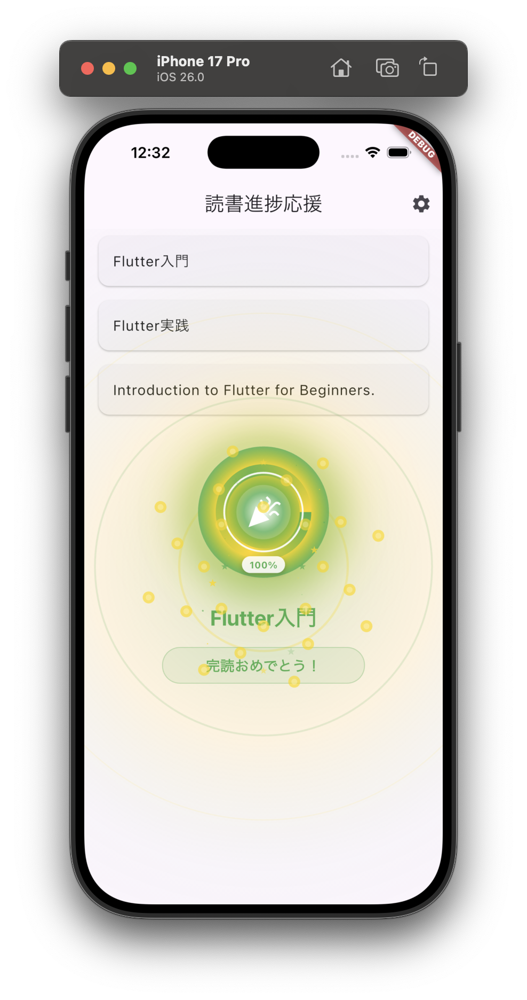


紙吹雪や花火のようなアニメーション表現のウィジェットも`Stack` に追加しましょう。  
コメントを解除してアニメーションを適用すれば、より華やかな演出になります。

**作業対象**
```
lib/src/presentation/ui_widget/challenge/home/reading_progress_animations_widget.dart

lib
├── src
│   ├── app
│   ├── application
│   ├── domain
│   ├── fundamental
│   ├── infrastructure
│   ├── presentation
│   │   ├── ui_widget
│   │   │   ├── challenge
│   │   │   │   ├── home
│   │   │   │   │   ├── components
│   │   │   │   │   ├── currently_tasks_widget.dart
│   │   │   │   │   ├── reading_progress_animations_widget.dart  // これが対象
│   │   │   │   │   └── reading_support_animations_widget.dart
```

- **修正前**  
**_ProgressAchievementAnimationState.build()** 
[L434-L439](https://github.com/FlutterKaigi/conference-handson-2025/blob/develop/lib/src/presentation/ui_widget/challenge/home/reading_progress_animations_widget.dart#L434-L439),
[L442-L447](https://github.com/FlutterKaigi/conference-handson-2025/blob/develop/lib/src/presentation/ui_widget/challenge/home/reading_progress_animations_widget.dart#L442-L447)
```dart
// ステップ4: 【おまけ】他のアニメーションを重ねる①
// if (widget.isCompletion)
//   ParticleEffectWidget(
//     animation: _particleController,
//     color: widget.secondaryColor,
//   ),

// ステップ4: 【おまけ】他のアニメーションを重ねる②
// SparkleEffectWidget(
//   animation: _sparkleAnimation,
//   primaryColor: widget.primaryColor,
//   secondaryColor: widget.secondaryColor,
//   isCompletion: widget.isCompletion,
// ),
```


花火のように粒子が広がる`ParticleEffectWidget`と、紙吹雪のように星が舞う`SparkleEffectWidget`を有効化し、演出を重ねます。  

- _[ParticleEffectWidget](https://github.com/FlutterKaigi/conference-handson-2025/blob/develop/lib/src/presentation/ui_widget/challenge/home/components/progress/particle_effect_widget.dart#L6-L51) は、  
  [CustomPainter](https://api.flutter.dev/flutter/rendering/CustomPainter-class.html) から派生させた
  [_ParticleEffectPainter](https://github.com/FlutterKaigi/conference-handson-2025/blob/develop/lib/src/presentation/ui_widget/challenge/home/components/progress/particle_effect_widget.dart#L53-L158) で、  
  花火のようにぱぁっと粒子が広がるアニメーションを表現します。_

- _[SparkleEffectWidget](https://github.com/FlutterKaigi/conference-handson-2025/blob/develop/lib/src/presentation/ui_widget/challenge/home/components/progress/sparkle_effect_widget.dart#L6-L70) は、  
  [CustomPainter](https://api.flutter.dev/flutter/rendering/CustomPainter-class.html) から派生させた
  [_SparkleEffectPainter](https://github.com/FlutterKaigi/conference-handson-2025/blob/develop/lib/src/presentation/ui_widget/challenge/home/components/progress/sparkle_effect_widget.dart#L72-L170) で、  
  紙吹雪のようにひらひらと星が舞うアニメーションを表現します。_

<br/>

- **修正後**  
**_ProgressAchievementAnimationState.build()** 
[L434-L439](https://github.com/FlutterKaigi/conference-handson-2025/blob/develop/lib/src/presentation/ui_widget/challenge/home/reading_progress_animations_widget.dart#L434-L439),
[L442-L447](https://github.com/FlutterKaigi/conference-handson-2025/blob/develop/lib/src/presentation/ui_widget/challenge/home/reading_progress_animations_widget.dart#L442-L447)
```dart
// ステップ4: 【おまけ】他のアニメーションを重ねる①
if (widget.isCompletion)
  ParticleEffectWidget(
    animation: _particleController,
    color: widget.secondaryColor,
  ),

// ステップ4: 【おまけ】他のアニメーションを重ねる②
SparkleEffectWidget(
  animation: _sparkleAnimation,
  primaryColor: widget.primaryColor,
  secondaryColor: widget.secondaryColor,
  isCompletion: widget.isCompletion,
),
```

- ステップ4の完成例（再掲）  
  

_hot restart を実行してから、ここまでの作業を再確認しましょう。_


<br/>

#### まとめ

この工程では、複数のアニメーションを協調させて複雑な演出を作り出すための技術を学習しました。  
`Listenable.merge`を使うことで、複数の独立した`AnimationController`を一つにまとめました。  
これにより、`AnimationBuilder`で、異なる時間軸で動く複数のアニメーションが使えるようになります。

これらの技術を用いることで、よりリッチで魅力のあるUIが構築できるでしょう。

- **【補足】進捗率達成メッセージ・アニメーション構成概要**  
  読書進捗率に応じて表示する「進捗達成メッセージ」に追加したアニメーションは、  
  以下のような、いくつものアニメーションエフェクトを積み重ねた構成になっています。
```text
ReadingProgressAnimationsWidget           進捗率達成メッセージのアニメーションウィジェット
└── Stack
    ├── DynamicBackgroundWidget           放射状にグローが広がる背景エフェクト
    ├── RippleEffectWidget                波紋が広がるような背景エフェクト
    │                                     
    ├── AnimationBuilder                  (コンテンツに複数のアニメーションを適用)
    │   └── _buildMainContent()           (進捗率達成メッセージコンテンツ)
    │       └── Column
    │           ├── ProgressCircleWidget  進捗率とアイコンを納めた円イメージ
    │           ├── TitleTextWidget       書籍名
    │           └── MessageTextWidget     応援メッセージ
    │                                     
    ├── ParticleEffectWidget              花火のように粒子が広がる前景エフェクト
    └── SparkleEffectWidget               ひらひらと星が舞う前景エフェクト
```

<br/>
<br/>

### 表示完了後コールバックとトランジションアニメーション表現

- **この章でやること**  
  グラフ表示画面を開けば、読書進捗率が円グラフで表示されます。  
  ここに`読書進捗率までグラフが進んでいき、読了なら更にお祝いメセージを追加する`、**円グラフのアニメーション** を追加しましょう。

このパートでは次の Flutter API を扱います。

- **[WidgetsBinding.instance.addPostFrameCallback() method](https://api.flutter.dev/flutter/scheduler/SchedulerBinding/addPostFrameCallback.html)**
  - _**[WidgetsBinding.instance](https://api.flutter.dev/flutter/widgets/WidgetsBinding/instance.html)** は、**[WidgetsBinding mixin](https://api.flutter.dev/flutter/widgets/WidgetsBinding-mixin.html)** の Static property です。_  
- **[Tween class](https://api.flutter.dev/flutter/animation/Tween-class.html)**
- **[AnimatedSwitcher ウィジェット](https://api.flutter.dev/flutter/widgets/AnimatedSwitcher-class.html)**

アニメーションの遅延実行やトランジションを適用したウィジェット切り替えを学習します。

_hot restart を実行してから、現在の状況を確認しましょう。_

_**現時点では読書進捗率円グラフは表示されません**。_


<br/>

#### ステップ1: 画面表示完了後に円グラフ描画を予約
- ステップ1からステップ2までの完成例  
  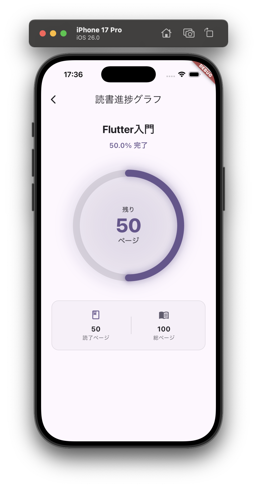

今回の進捗率円グラフは画面表示の瞬間に描画するのではなく、  
背景のグレーの円を含む画面表示の完了後に、それをなぞる様に遅延実行させて、進捗率円グラフのアニメーションを表現しましょう。

**[WidgetsBinding.instance.addPostFrameCallback() method](https://api.flutter.dev/flutter/scheduler/SchedulerBinding/addPostFrameCallback.html)** は、画面の描画が完了した直後に一度だけ実行されるコールバック関数を登録します。  
このメソッドを使い、コールバック関数に進捗率円グラフを描画する処理関数を渡すことで、画面表示後にアニメーションを行わせます。

```
lib/src/presentation/ui_widget/challenge/reading_graph/reading_book_graph_widget.dart

lib
├── src
│   ├── app
│   ├── application
│   ├── domain
│   ├── fundamental
│   ├── infrastructure
│   ├── presentation
│   │   ├── ui_widget
│   │   │   ├── challenge
│   │   │   │   ├── reading_graph
│   │   │   │   │   ├── components
│   │   │   │   │   └── reading_book_graph_widget.dart  // これが対象
```

修正前は、進捗率円グラフの描画処理がコメントアウトされています。

- **修正前**  
**ReadingBookGraphWidget.build()** 
[L57-L60](https://github.com/FlutterKaigi/conference-handson-2025/blob/develop/lib/src/presentation/ui_widget/challenge/reading_graph/reading_book_graph_widget.dart#L57-L60)
```dart
// ステップ1: 画面表示完了後に円グラフ描画を予約
// WidgetsBinding.instance.addPostFrameCallback((_) {
//   controllers.animateToProgress(progress);
// });
```


円グラフの描画を行う`controllers.animateToProgress()`メソッドを画面描画の完了直後に実行されるコールバック関数でコールされるようにします。
- _`controllers`変数には、後述の [DonutAnimationState](https://github.com/FlutterKaigi/conference-handson-2025/blob/develop/lib/src/presentation/ui_widget/challenge/reading_graph/reading_book_graph_widget.dart#L97-L197) クラスのオブジェクトが入ります。_  
  - _このため `controllers.animateToProgress()`は、[DonutAnimationState.animateToProgress()](https://github.com/FlutterKaigi/conference-handson-2025/blob/develop/lib/src/presentation/ui_widget/challenge/reading_graph/reading_book_graph_widget.dart#L150-L177) メソッドがコールされます。_

<br/>

- **修正後**  
**ReadingBookGraphWidget.build()** 
[L57-L60](https://github.com/FlutterKaigi/conference-handson-2025/blob/develop/lib/src/presentation/ui_widget/challenge/reading_graph/reading_book_graph_widget.dart#L57-L60)
```dart
// ステップ1: 画面表示完了後に円グラフ描画を予約
WidgetsBinding.instance.addPostFrameCallback((_) {
  controllers.animateToProgress(progress);
});
```


<br/>

#### ステップ2: 進捗に合わせた終了値を指定し開始
前ステップで画面描画の完了直後にコールされるようにした`animateToProgress` メソッド内を修正します。

**[Tween class](https://api.flutter.dev/flutter/animation/Tween-class.html)** で円グラフ描画の値範囲と変化の緩急を定義し、
**[unawaited() function](https://api.flutter.dev/flutter/dart-async/unawaited.html)** で非同期並行でアニメーションを実行させましょう。

- **[Tween class](https://api.flutter.dev/flutter/animation/Tween-class.html)** は、  
  アニメーション表現のために変化するデータの値範囲とアニメーション進捗率の 0.0 〜 1.0 を対応させるマッパーです。  
  `Tween`により、`AnimationController`のアニメーション値から、対応するアニメーション表現のデータ値が取得できるようになります。
  - ここでは円グラフの描画が、以前の読書進捗値（`animatedProgress`）から、新しい読書進捗率（`progress`）まで変化するよう設定します。
  - さらに`progressController`を時間軸として使用し、[Curves.easeOutCubic](https://api.flutter.dev/flutter/animation/Curves/easeInOutCubic-constant.html) という緩急変化を適用します。  
  - これらにより円グラフ描画のアニメーションが、以前の値から滑らかに加速したあと徐々に減速し、自然な動きで新しい値に到達します。  
    _ただし今回の実装では、円グラフ画面が破棄されるため `animatedProgress` が保持されず、常に0% 始まりとなります。_

- **[AnimationController](https://api.flutter.dev/flutter/animation/AnimationController-class.html).[reset()](https://api.flutter.dev/flutter/animation/AnimationController/reset.html)** を表す`progressController!.reset()`は、  
  アニメーションを停止し(進行中の場合)、初期状態にリセットする命令です。新しいアニメーションを開始できるようにします。

- **[unawaited() function](https://api.flutter.dev/flutter/dart-async/unawaited.html)** で`progressController!.forward()`を実行させることにより、
  新しいアニメーションを非同期平行に実行させます。

修正前は、アニメーションの定義とアニメーションの実行はコメントアウトされています。

- **修正前**  
**DonutAnimationState.animateToProgress()** 
[L161-L171](https://github.com/FlutterKaigi/conference-handson-2025/blob/develop/lib/src/presentation/ui_widget/challenge/reading_graph/reading_book_graph_widget.dart#L161-L171),
[L174-L175](https://github.com/FlutterKaigi/conference-handson-2025/blob/develop/lib/src/presentation/ui_widget/challenge/reading_graph/reading_book_graph_widget.dart#L174-L175)
```dart
// ステップ2: 進捗に合わせた終了値を指定し開始
// progressAnimation =
//     Tween<double>(
//       begin: animatedProgress, 
//       end: progress,
//     ).animate(
//       CurvedAnimation(
//         parent: progressController!,
//         curve: Curves.easeOutCubic,
//       ),
//     );

// progressController!.reset();
// unawaited(progressController!.forward());
```


円グラフ描画のアニメーションを定義し、非同期並行でアニメーションの実行を指示します。

- **修正後**  
**DonutAnimationState.animateToProgress()** 
[L161-L171](https://github.com/FlutterKaigi/conference-handson-2025/blob/develop/lib/src/presentation/ui_widget/challenge/reading_graph/reading_book_graph_widget.dart#L161-L171),
[L174-L175](https://github.com/FlutterKaigi/conference-handson-2025/blob/develop/lib/src/presentation/ui_widget/challenge/reading_graph/reading_book_graph_widget.dart#L174-L175)
```dart
// ステップ2: 進捗に合わせた終了値を指定し開始
progressAnimation =
    Tween<double>(
      begin: animatedProgress,
      end: progress,
    ).animate(
      CurvedAnimation(
        parent: progressController!,
        curve: Curves.easeOutCubic,
      ),
    );

progressController!.reset();
unawaited(progressController!.forward());
```

- ステップ1からステップ2までの完成例（再掲）  
  

_hot restart を実行してから、ここまでの作業を再確認しましょう。_

円グラフが表示され、以前の読書進捗率から新しい読書進捗率へグラフが伸びながら遷移します。


<br/>

#### ステップ3: 完読時には専用メッセージ表示
- ステップ3の完成例  
  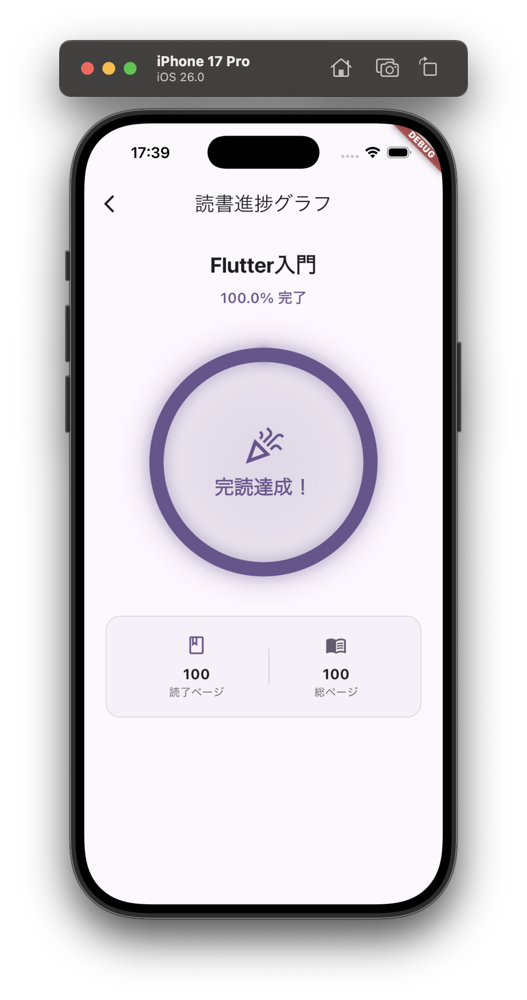

完読時は円グラフの中央にお祝いメッセージが表示されるように修正します。  
表示するウィジェットを切り替える際にトランジションアニメーションを適用するように`AnimatedSwitcher`を利用します。

- **[AnimatedSwitcher ウィジェット](https://api.flutter.dev/flutter/widgets/AnimatedSwitcher-class.html)** は、以前の子ウィジェットから新しい子ウィジェットへの表示切り替えを  
  任意の遷移方法を使った、滑らかなアニメーションで表示遷移（トランジション）させてくれるウィジェットです。  
  - 主なコンストラクタ引数
    - `duration` トランジションアニメーションの適用時間を指定します。
    - `transitionBuilder`: 新旧の子ウィジェットの表示切替描画方法を定義します。
    - `layoutBuilder`: 新旧の子ウィジェットのレイアウト切替描画方法を定義します。
    - `switchInCurve`: 新旧の子ウィジェットが切り替わる前までの緩急変化を指定します。
    - `switchOutCurve`: 新旧の子ウィジェットが切り替わった後からの緩急変化を指定します。
    - `child` 子ウィジェットを指定します。  
      _(注) 新旧の子ウィジェットで型やレイアウトが変わる場合は、`Key`を指定して区別できるようにしてください。_

**作業対象**
```
lib/src/presentation/ui_widget/challenge/reading_graph/components/donut_chart_center_content.dart

lib
├── src
│   ├── app
│   ├── application
│   ├── domain
│   ├── fundamental
│   ├── infrastructure
│   ├── presentation
│   │   ├── ui_widget
│   │   │   ├── challenge
│   │   │   │   ├── reading_graph
│   │   │   │   │   ├── components
│   │   │   │   │   │   ├── donut_chart_center_content.dart  // これが対象
│   │   │   │   │   │   ├── その他ウィジェット
│   │   │   │   │   └── reading_book_graph_widget.dart
```

作業前の時点では仮の実装があります。ここでは残ページ数を表示するウィジェットを指定しています。

- **修正前**  
**DonutChartCenterContent.build()** 
[L34-L49](https://github.com/FlutterKaigi/conference-handson-2025/blob/develop/lib/src/presentation/ui_widget/challenge/reading_graph/components/donut_chart_center_content.dart#L34-L49)
```dart
// ステップ3: 完読時には専用メッセージ表示
// return AnimatedSwitcher(
//   duration: const Duration(milliseconds: 600),
//   child: Container(
//     key: ValueKey<bool>(isCompleted),
//     padding: const EdgeInsets.all(16),
//     child: isCompleted
//         ? const CompletionContent()
//         : ProgressContent(remainingPages: remainingPages),
//   ),
// );
return Container(
  key: ValueKey<bool>(isCompleted),
  padding: const EdgeInsets.all(16),
  child: ProgressContent(remainingPages: remainingPages),
);
```


完読時には残ページ数ではなく専用メッセージを表示するように`AnimatedSwitcher`で切り替えます。

- ここでの AnimatedSwitcher では、
  - トランジションアニメーションを 600ミリ秒適用します。
  - 読書完了を示す `isCompleted` bool 値により、何れかの子ウィジェットに切り替えます。  
    - true: [CompletionContent ウィジェット](https://github.com/FlutterKaigi/conference-handson-2025/blob/develop/lib/src/presentation/ui_widget/challenge/reading_graph/components/donut_chart_center_content.dart#L53-L79)、「完読達成！」を表示します。
    - false: [ProgressContent ウィジェット](https://github.com/FlutterKaigi/conference-handson-2025/blob/develop/lib/src/presentation/ui_widget/challenge/reading_graph/components/donut_chart_center_content.dart#L81-L124)、「残りページ」を表示します。

<br/>

- **修正後**  
**DonutChartCenterContent.build()** 
[L34-L49](https://github.com/FlutterKaigi/conference-handson-2025/blob/develop/lib/src/presentation/ui_widget/challenge/reading_graph/components/donut_chart_center_content.dart#L34-L49)
```dart
// ステップ3: 完読時には専用メッセージ表示
return AnimatedSwitcher(
  duration: const Duration(milliseconds: 600),
  child: Container(
    key: ValueKey<bool>(isCompleted),
    padding: const EdgeInsets.all(16),
    child: isCompleted
        ? const CompletionContent()
        : ProgressContent(remainingPages: remainingPages),
  ),
);
```

- ステップ3の完成例（再掲）  
  

_hot restart を実行してから、ここまでの作業を再確認しましょう。_

読書進捗率が 100% 未満なら、円グラフ描画の後も「残りページ数」が表示され、  
読書進捗率が 100% になれば、円グラフ描画の後に「残りページ数」から「完読達成！」への表示遷移がおこります。


<br/>

#### まとめ
アニメーションの遅延実行やトランジションアニメーションを適用したウィジェット切り替えを学習しました。  
これらの技術を通じて、単なる静的なUIではなく、ユーザーの操作に自然に応答する動的なUIを構築できます。

### 完成させたカスタムUI の機能要件表現を確認する。
ハンズオンお疲れ様でした。これでカスタムUIの虫食い実装は完了です。作成したカスタムUIの要件について改めて確認します。

- 進捗応援アニメーション
  - 読書進捗に応じた応援アニメーションを書籍一覧ページに重ねて表示する。
  - アニメーションは複数組み合わせ、読書の達成感や継続するためのモチベーションの向上を目指す。
- 読書進捗グラフ
  - 本の総ページ数に対する現在の進捗や残りページ数を視覚的に表現する。
  - 瞬間的な表示ではなく、徐々に描画することで進捗の積み重ねの視覚的表現を強化し、努力の肯定感を高める。

シンプルなUIでも機能は満たせますが、アニメーションを実装することで、ユーザーへの印象づけや動機づけなど、体験の向上ができます。

<br/>
<br/>

----------

## 完成版カスタムUI と比較しよう。

Android Studio などの IDEを使っている方は、`lib/src/presentation/ui_widget/challenge/`ディレクトリと  
`lib/src/presentation/ui_widget/complete/`ディレクトリを選択してから、マウス右クリックを行って、  
ポップアップメニューから **compare Directories** を選択して両者を比較してみてください。 

- _ハンズオンでの作業がうまく行っていれば、目立った違いが出ていないと思います。_
- _ここで食い違いが見つかりましたら、challengeディレクトリのカスタムUIコードを修正してください。_

### complete バレルファイルを有効にする。

完成版カスタムUIのコードファイルは、
`lib/src/presentation/ui_widget/complete/`ディレクトリに配置されているので、  
**completeディレクトリのバレルファイル(`lib/src/presentation/ui_widget/complete/widget_packages.dart`)** が有効になるよう、  
**UIウィジェット・パッケージ全体のバレルファイル** を修正します。

UIウィジェット・パッケージ全体のバレルファイル [lib/src/presentation/ui_widget/widget_packages.dart](../lib/src/presentation/ui_widget/widget_packages.dart) を開いて、  
デフォルト設定(`complete/widget_packages.dart`)の export 行のコメントアウトのみを外して、  
他の export 行をコメントアウトしてください。

```dart
// UI Widget として各ページごとの任意のパッケージをインポートできるようにするバレルパッケージです。

// デフォルト設定 （ui_widget/default）
// export 'default/widget_packages.dart';

// 完成形設定 （ui_widget/complete）
export 'complete/widget_packages.dart';

// ハンズオン設定 （ui_widget/challenge）
// export 'challenge/widget_packages.dart';
```

### 完成版カスタムUI の機能要件表現を確認する。

ui_widget/completeディレクトリ配下の 完成形カスタムUIのコードを参照させるようにしたので、  
**'<a href="#%E3%83%99%E3%83%BC%E3%82%B9ui-%E3%82%92%E4%BD%BF%E3%81%A3%E3%81%9F%E6%A9%9F%E8%83%BD%E8%A6%81%E4%BB%B6%E8%A1%A8%E7%8F%BE%E3%82%92%E7%A2%BA%E8%AA%8D%E3%81%99%E3%82%8B">ベースUI を使った機能要件表現を確認する</a>'①** 章の
**読了したページの更新に伴う進捗率達成メッセージを表示する。** と  
**読了したページの進捗をグラフで表示する。** での操作を参考に、完成形カスタムUIでのデザインやアニメーション表現を確認してください。

- _①のリンクを開く際は、リンクURLが指定フラグメント・ベースになるため、右クリックして別ウィンドウでお開きください。_
- _アニメーション表現は、読了したページ数が 規定の進捗率（10%, 50%, 80%, 100%）に初めて達したときに変化しますので、  
  機能要件表現を確認をされる際は、これら規定の進捗率を考慮しながら読了ページを更新してみてください。_

### 完成版カスタムUI コードを確認する。

#### 完成形カスタムUIコードに関連するファイル構成
```text
lib
└── src
    ├── presentation
    │   ├── ui_widget（各UIウィジェットは、状態種別や状態値更新と連動するため providerオブジェクトをバインドします）
    │   │   ├── complete
    │   │   │   ├── home
    │   │   │   │   ├── components
    │   │   │   │   │   └── progress                             読書中書籍進捗表示のUIコンポーネントを定義
    │   │   │   │   ├── currently_tasks_widget.dart              読書中書籍一覧表示のUIウィジェット　　　（defaultと同実装）
    │   │   │   │   ├── reading_progress_animations_widget.dart  読書中書籍進捗表示のUIウィジェット　　　（completeカスタム）
    │   │   │   │   └── reading_support_animations_widget.dart   激励一喝表示のUIウィジェット　　　　　　（defaultと同実装）
    │   │   │   ├── reading
    │   │   │   │   └── reading_book_widget.dart                 読書中書籍編集表示のUIウィジェット　　　（defaultと同実装）
    │   │   │   ├── reading_graph
    │   │   │   │   ├── components                               読書中書籍進捗グラフ表示のUIコンポーネントを定義
    │   │   │   │   └── reading_book_graph_widget.dart           読書中書籍進捗グラフ表示のUIウィジェット（completeカスタム）
    │   │   │   ├── settings
    │   │   │   │   └── reading_book_settings_widget.dart        設定表示のUIウィジェット　　　　　　　　（defaultと同実装）
    │   │   │   └── widget_packages.dart                        （completeディレクトリ用のバレルファイル）
    │   │   └── widget_packages.dart                            （UIウィジェット全体統括のバレルファイル）
```

#### 完成形カスタムUI コード
- **完成形カスタムUIコード**
  - **home（書籍一覧画面のUI表示）**
    - [reading_progress_animations_widget.dart](../lib/src/presentation/ui_widget/complete/home/reading_progress_animations_widget.dart)  
      読書中書籍進捗表示のUIウィジェット

  - **reading_graph（書籍進捗率グラフ画面のUI表示）**
    - [reading_book_graph_widget.dart](../lib/src/presentation/ui_widget/complete/reading_graph/reading_book_graph_widget.dart)  
      読書中書籍進捗グラフ表示のUIウィジェット

- **UIウィジェット - バレルファイル**
  - **UIウィジェット全体統括用**  
    [widget_packages.dart](../lib/src/presentation/ui_widget/widget_packages.dart)

    - **completeディレクトリ用**  
      [widget_packages.dart](../lib/src/presentation/ui_widget/complete/widget_packages.dart)

- **【補足】完成形カスタムUIの機能要件実装設計ガイド**  
  _よろしければ、カスタムUI実装設計時のキーポイント説明も御参照ください。_  
  - **読書中書籍進捗グラフ表示**  
    [インタラクティブドーナツチャート実装ガイド](./ui_widget/interactive_donut_chart_guide.md)

<br/>
<br/>

----------

## 宿題

**読了したページの更新に伴う進捗率達成メッセージ** や **読了したページの進捗のグラフ表示** のカスタムUIがあるのに、  
**激励や一喝のメッセージ** はどこに行ったのだろうと思われているのではないでしょうか。

この機能要件については、ハンズオンチームでのカスタムUI実装をしていないので、  
これは、ハンズオンに参加してくださったみなさまへの宿題とさせていただきます。

<br/>
<br/>

----------

## お疲れ様でした。

<br/>
<br/>

----------
